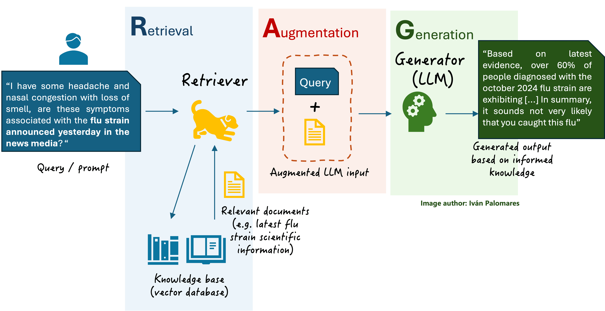
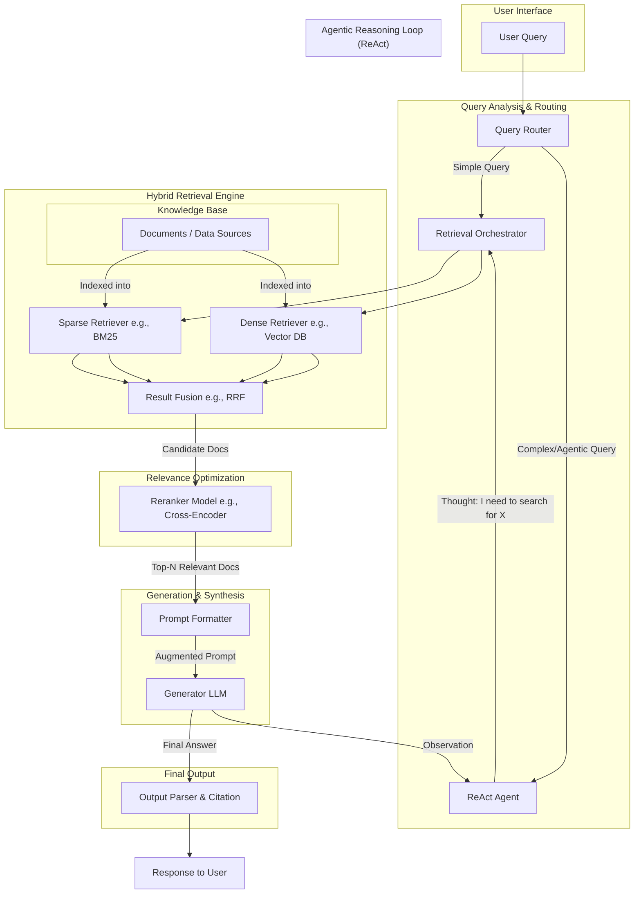

---
## Executive Summary
---
<details>
<summary>A High-Level Overview of RAG and Reasoning Frameworks</summary>
---
- This report provides a comprehensive guide to Retrieval-Augmented Generation (RAG) and associated reasoning frameworks, designed for both technical implementation teams and strategic business stakeholders.
- It deconstructs the architecture, components, and advanced techniques required to build intelligent AI systems that can reason over and interact with external knowledge bases.
- **Part 1** offers a detailed, step-by-step tutorial on building a foundational RAG system. It includes complete, runnable Python code using popular libraries like LangChain and Chroma, covering the end-to-end pipeline from document loading to answer generation.
- **Part 2** conducts an in-depth comparative analysis of critical RAG components and advanced reasoning frameworks. This includes a detailed breakdown of vector databases (Pinecone, Weaviate, Chroma), chunking strategies, and a taxonomy of reasoning methods like Chain of Thought (CoT), Tree of Thoughts (ToT), and ReAct.
- **Part 3** presents a system architecture for a production-grade, advanced RAG system. A Mermaid diagram illustrates a sophisticated pipeline incorporating hybrid search, reranking, and an agentic reasoning loop, with a full explanation of each component's role.
- **Part 4** focuses on optimization, evaluation, and cost. It covers performance-enhancing techniques like hybrid search and reranking, robust evaluation methodologies using frameworks like RAGAS, and a practical analysis of the costs and deployment strategies associated with RAG systems.
- **Part 5** translates these complex technical concepts for a business audience. It uses simple analogies to explain what RAG is, why it's a game-changer for enterprises, and how it delivers tangible business value by mitigating AI hallucinations, unlocking proprietary data, and ensuring information currency.
- The central thesis is that the future of applied AI lies in modular systems that decouple knowledge from reasoning. RAG provides the mechanism to ground LLMs in verifiable facts, while reasoning frameworks provide the structure for them to "think" methodically. Mastering both is essential for building trustworthy, scalable, and truly intelligent AI solutions.
---
</details>

---
## Part 1: Detailed Tutorial
---
### A Practical Guide to Building a RAG System with LangChain
<details>
<summary>A Step-by-Step Implementation Walkthrough</summary>
---
- This tutorial provides a complete, hands-on guide to building a functional Retrieval-Augmented Generation (RAG) pipeline from scratch.
- We will use popular, open-source tools from the Python ecosystem: LangChain as the orchestration framework, Chroma as the local vector database, and models from Hugging Face for embedding and generation.
- The goal is to create a simple question-answering system that can answer queries based on a provided text document.

---
#### Step 1: Environment Setup and Installation
- Ensure you have a Python environment (`>=3.9`). While a GPU is beneficial for the generator LLM, this example can run on a CPU.
- Install the necessary libraries using pip.
  ```bash
  # Core RAG framework
  pip install -q -U langchain
  # For the LLM and Embedding models
  pip install -q -U langchain-huggingface
  # For loading documents
  pip install -q -U langchain_community
  # Vector Database
  pip install -q -U chromadb
  # SentenceTransformers for embeddings
  pip install -q -U sentence-transformers
  # For loading PDF documents
  pip install -q -U pypdf
  ```
- **Library Roles**:
  - `langchain`: The primary framework that provides the "glue" and standard interfaces for chaining together different RAG components.
  - `langchain-huggingface`: Provides integrations for using LLMs and embedding models from the Hugging Face ecosystem.
  - `langchain_community`: Contains a wide array of community-maintained integrations for document loaders, vector stores, etc.
  - `chromadb`: An open-source, developer-friendly vector database that can run locally.
  - `sentence-transformers`: A library that provides easy access to a wide range of state-of-the-art embedding models.
  - `pypdf`: A library required by LangChain's PyPDFLoader to read and parse PDF files.

---
#### Step 2: Loading and Chunking Documents
- The first step in any RAG pipeline is to load your source knowledge and break it down into manageable chunks for the vector database.
- For this example, create a text file named `state_of_the_union.txt` and populate it with some text. (e.g., the transcript of a speech).
- **Document Loading**: LangChain provides various `DocumentLoader` classes for different file types (`.txt`, `.pdf`, `.html`, etc.).
- **Chunking**: We will use the `RecursiveCharacterTextSplitter`, which is a robust, general-purpose method. It tries to split text along a prioritized list of separators (like paragraphs, then sentences, then words) to maintain semantic coherence.
  ```python
  from langchain_community.document_loaders import PyPDFLoader, TextLoader
  from langchain.text_splitter import RecursiveCharacterTextSplitter

  # In this example, we'll load a simple text file.
  # If you were loading a PDF, you would use: loader = PyPDFLoader("your_document.pdf")
  loader = TextLoader("state_of_the_union.txt")
  documents = loader.load()

  # Initialize the text splitter
  text_splitter = RecursiveCharacterTextSplitter(
      chunk_size=1000,  # The maximum size of each chunk (in characters)
      chunk_overlap=200 # The number of characters to overlap between chunks
  )

  # Split the documents into chunks
  chunks = text_splitter.split_documents(documents)
  print(f"Split the document into {len(chunks)} chunks.")
  ```

---
#### Step 3: Generating Embeddings and Storing in a Vector Database
- Next, we need to convert our text chunks into numerical vectors (embeddings) and store them in our vector database, Chroma.
- **Embedding Model**: We will use a popular, high-performance open-source model from Hugging Face. The `bge-base-en-v1.5` model is a strong choice.
- **Vector Database**: We will use ChromaDB. LangChain's Chroma integration makes it easy to create a database from our chunks and embedding model in a single step.
  ```python
  from langchain_huggingface import HuggingFaceEmbeddings
  from langchain_community.vectorstores import Chroma

  # Define the embedding model to use
  model_name = "BAAI/bge-base-en-v1.5"
  model_kwargs = {'device': 'cpu'} # Use 'cuda' if you have a GPU
  encode_kwargs = {'normalize_embeddings': True}
  embeddings = HuggingFaceEmbeddings(
      model_name=model_name,
      model_kwargs=model_kwargs,
      encode_kwargs=encode_kwargs
  )

  # Create a Chroma vector store from the chunks
  # This will automatically generate embeddings for each chunk and store them.
  vectorstore = Chroma.from_documents(
      documents=chunks, 
      embedding=embeddings,
      persist_directory="./chroma_db" # Directory to save the database
  )

  print("Vector store created successfully.")
  ```

---
#### Step 4: Implementing the Retrieval and Generation Chain
- With our knowledge base indexed, we can now build the question-answering part of the pipeline.
- **Retriever**: The retriever is a component that fetches relevant documents from the vector store based on a query. We can easily create one from our `vectorstore`.
- **LLM**: For the generation step, we will use a small, efficient model from Hugging Face that can run on a CPU, like `google/flan-t5-base`.
- **Chain**: LangChain's `RetrievalQA` chain provides a simple way to combine the retriever and the LLM into a single, callable object.
  ```python
  from langchain_huggingface import HuggingFaceEndpoint
  from langchain.chains import RetrievalQA
  import os

  # NOTE: You need a Hugging Face API token for this step.
  # Set it as an environment variable: os.environ["HUGGINGFACEHUB_API_TOKEN"] = "your_token"

  # Initialize the LLM
  # Using an endpoint is more scalable than running the model locally for this example
  repo_id = "google/flan-t5-large"
  llm = HuggingFaceEndpoint(
      repo_id=repo_id, 
      max_length=128, 
      temperature=0.1
  )

  # Create the retriever
  retriever = vectorstore.as_retriever(search_kwargs={"k": 3}) # Retrieve top 3 chunks

  # Create the RetrievalQA chain
  qa_chain = RetrievalQA.from_chain_type(
      llm=llm,
      chain_type="stuff", # "stuff" means all retrieved chunks are "stuffed" into the prompt
      retriever=retriever,
      return_source_documents=True # Optionally return the source documents
  )
  ```

---
#### Step 5: Putting It All Together: A Complete, Runnable Example
- This script combines all the previous steps into one file.
  ```python
  import os
  from langchain_community.document_loaders import TextLoader
  from langchain.text_splitter import RecursiveCharacterTextSplitter
  from langchain_huggingface import HuggingFaceEmbeddings, HuggingFaceEndpoint
  from langchain_community.vectorstores import Chroma
  from langchain.chains import RetrievalQA

  # --- CONFIGURATION ---
  # Make sure to create a 'state_of_the_union.txt' file with some text.
  # Set your Hugging Face API token as an environment variable
  # os.environ["HUGGINGFACEHUB_API_TOKEN"] = "hf_..." 

  if not os.getenv("HUGGINGFACEHUB_API_TOKEN"):
      raise ValueError("Hugging Face API token not set. Please set the HUGGINGFACEHUB_API_TOKEN environment variable.")

  # --- 1. LOADING & CHUNKING ---
  print("Step 1: Loading and Chunking Document...")
  loader = TextLoader("state_of_the_union.txt")
  documents = loader.load()
  text_splitter = RecursiveCharacterTextSplitter(chunk_size=1000, chunk_overlap=200)
  chunks = text_splitter.split_documents(documents)
  print(f"--> Document split into {len(chunks)} chunks.")

  # --- 2. EMBEDDING & VECTOR STORAGE ---
  print("\nStep 2: Embedding Chunks and Storing in Chroma DB...")
  # Use a powerful open-source embedding model
  embedding_model_name = "BAAI/bge-base-en-v1.5"
  embeddings = HuggingFaceEmbeddings(
      model_name=embedding_model_name,
      model_kwargs={'device': 'cpu'}, # Change to 'cuda' if GPU is available
      encode_kwargs={'normalize_embeddings': True}
  )

  # Create and persist the vector store
  vectorstore = Chroma.from_documents(
      documents=chunks, 
      embedding=embeddings,
      persist_directory="./chroma_db"
  )
  print("--> Vector store created and persisted.")

  # --- 3. RETRIEVAL & GENERATION ---
  print("\nStep 3: Setting up the RAG Chain...")
  # Set up the retriever
  retriever = vectorstore.as_retriever(search_kwargs={"k": 3}) # Retrieve top 3 most relevant chunks

  # Set up the LLM for generation
  llm_repo_id = "google/flan-t5-large"
  llm = HuggingFaceEndpoint(
      repo_id=llm_repo_id, 
      max_new_tokens=256, 
      temperature=0.1
  )

  # Create the Question-Answering chain
  qa_chain = RetrievalQA.from_chain_type(
      llm=llm,
      chain_type="stuff", # Use 'stuff' chain type to combine all retrieved docs into the prompt
      retriever=retriever,
      return_source_documents=True
  )
  print("--> RAG chain is ready.")

  # --- 4. ASK A QUESTION ---
  print("\nStep 4: Asking a question...")
  query = "What did the president say about Ketanji Brown Jackson?"
  result = qa_chain.invoke({"query": query})

  print("\n--- QUERY ---")
  print(query)
  print("\n--- ANSWER ---")
  print(result["result"])
  print("\n--- SOURCE DOCUMENTS ---")
  for doc in result["source_documents"]:
      print(f"- Source: {doc.metadata.get('source', 'N/A')}, Content: {doc.page_content[:150]}...")
  ```

---
#### Real-World Applications of RAG Systems
- RAG is a versatile architecture used to build a wide range of knowledge-intensive applications.
- **Customer Support Automation**:
  - **Knowledge Base**: Product manuals, troubleshooting guides, and historical support tickets.
  - **Application**: A chatbot that provides instant, accurate answers to customer queries, reducing the load on human agents and improving response times.
- **Internal Knowledge Management**:
  - **Knowledge Base**: A company's internal wiki, project documentation (Confluence), HR policies, and shared drive documents.
  - **Application**: An internal "Ask HR" or "Ask Engineering" tool that allows employees to quickly find information without having to search through multiple systems or ask colleagues.
- **Financial and Legal Analysis**:
  - **Knowledge Base**: Financial reports (10-K filings), legal contracts, case law, or market analysis documents.
  - **Application**: An assistant for analysts and lawyers that can summarize complex documents, identify key clauses or risk factors, and answer specific questions about the content, complete with source citations for verifiability.
---
</details>

---
## Part 2: Comparison – Analysis – Evaluation
---
### A Deep Dive into RAG Components
<details>
<summary>Analysis of Chunking Strategies</summary>
---
- The way documents are split into chunks is a critical, foundational step that significantly impacts retrieval quality. There is no one-size-fits-all solution.
- **Fixed-Size Chunking**:
  - **Mechanism**: The simplest method. Splits text into segments of a fixed character or token count, with an optional overlap.
  - **Pros**: Very fast and simple to implement.
  - **Cons**: Semantically unaware. High risk of breaking sentences or coherent thoughts in half, which destroys context.
- **Recursive Character Chunking**:
  - **Mechanism**: A more intelligent approach that attempts to split text along a prioritized list of separators (e.g., `\n\n`, `\n`, `.`, ` `). It tries to keep paragraphs and sentences intact.
  - **Pros**: A great balance of performance and semantic preservation. The recommended default choice for most text documents.
  - **Cons**: Still not perfect; its effectiveness depends on the structure of the text and the defined separators.
- **Document-Specific (Structural) Chunking**:
  - **Mechanism**: Splits documents based on their intrinsic structure, such as Markdown headers (`#`), HTML tags (`<div>`), or code constructs (functions, classes).
  - **Pros**: Creates the most contextually coherent chunks by aligning them with the document's logical organization.
  - **Cons**: Requires custom parsing logic for each document type, making it less generalizable.
- **Semantic Chunking**:
  - **Mechanism**: An advanced, content-aware method. It uses an embedding model to find "semantic breakpoints" between sentences where the topic changes, and splits the text there.
  - **Pros**: Produces the most semantically coherent chunks, leading to higher retrieval accuracy.
  - **Cons**: Computationally expensive, as it requires running an embedding model during the indexing/chunking phase.
- **Comparison Table**:

| Strategy   | Semantic Coherence | Computational Cost | Implementation Complexity | Best For                                                  |
|------------|--------------------|---------------------|----------------------------|-----------------------------------------------------------|
| Fixed-Size | Low                | Very Low            | Very Low                   | Quick prototyping on unstructured text.                  |
| Recursive  | Medium-High        | Low                 | Low                        | Default choice for most text documents.                  |
| Structural | Very High          | Medium              | Medium-High                | Structured data like Markdown, code, contracts.          |
| Semantic   | Highest            | High                | High                       | Accuracy-critical applications where indexing cost is secondary. |

---
</details>
<details>
<summary>Vector Database Showdown: Pinecone vs. Weaviate vs. Chroma</summary>
---
- Choosing a vector database is a key architectural decision that trades off scalability, features, and operational complexity.
- **Pinecone**:
  - **Positioning**: A fully managed, enterprise-grade, proprietary vector database.
  - **Strengths**: Designed for extreme scalability (billions of vectors) with low latency. High reliability and security (SOC 2). Easy to use for teams that want to offload infrastructure management.
  - **Weaknesses**: Paid service, can be costly at scale. Less flexibility due to its proprietary nature.
- **Weaviate**:
  - **Positioning**: A powerful, open-source vector database that can be self-hosted or used as a managed service.
  - **Strengths**: Highly flexible. Its standout feature is hybrid search (combining vector and keyword search) and its ability to act as a "knowledge graph" by managing relationships between data objects.
  - **Weaknesses**: Can have a steeper learning curve due to its rich feature set and GraphQL API.
- **Chroma (ChromaDB)**:
  - **Positioning**: A lightweight, open-source, developer-first vector database.
  - **Strengths**: Extremely simple to set up and use, especially for local development and prototyping. Tight integration with LangChain and the Python ecosystem.
  - **Weaknesses**: Less mature and not as feature-rich or proven at massive enterprise scale compared to Pinecone or Weaviate.
- **Comparison Table**:

| Feature            | Pinecone                                | Weaviate                                       | Chroma                                            |
|--------------------|------------------------------------------|------------------------------------------------|--------------------------------------------------|
| Core Model         | Fully Managed (Proprietary)              | Open-Source (Self-hosted & Managed)            | Open-Source (Primarily Self-hosted)              |
| Ideal Use Case     | Enterprise-scale production systems.     | Complex systems needing hybrid search & knowledge graphs. | Rapid prototyping, local development, smaller apps. |
| Scalability        | Very High (Billions of vectors)          | High (Hundreds of millions)                    | Medium (Tens of millions)                        |
| Key Differentiator| Managed simplicity and reliability at scale. | Hybrid search and GraphQL flexibility.         | Developer experience and ease of use.            |
| Cost Structure     | Paid, usage-based subscription.          | Open-source is free; managed tiers are paid.   | Open-source is free; managed cloud in preview.   |

---
</details>

---
### A Taxonomy of Reasoning Frameworks
<details>
<summary>Analysis of Reasoning Paradigms</summary>
---
- Reasoning frameworks provide structure to an LLM's thought process, elevating it from a text generator to a problem solver.
- **Chain of Thought (CoT): The Linear Paradigm**
  - **Mechanism**:
    - Prompts the LLM to generate a sequence of intermediate reasoning steps before giving a final answer (e.g., by adding "Let's think step by step").
    - It transforms a black-box Question -> Answer process into a more transparent Question -> Reasoning -> Answer flow.
  - **Pros**:
    - Dramatically improves performance on tasks requiring multi-step logic (math, commonsense reasoning).
    - Simple to implement with just prompt engineering.
  - **Cons**:
    - Brittle: It's a single, linear path. An error early in the chain corrupts the entire result, with no mechanism for self-correction.
- **Tree of Thoughts (ToT): Multi-Path Exploration**
  - **Mechanism**:
    - Generalizes CoT by exploring multiple reasoning paths simultaneously, forming a tree structure.
    - It follows a generate-evaluate-search cycle:
      - 1. **Generate**: The LLM proposes several potential next steps (thoughts).
      - 2. **Evaluate**: The LLM acts as a judge, scoring the viability of each path.
      - 3. **Search**: A search algorithm (like BFS or DFS) explores the most promising branches and prunes dead ends.
  - **Pros**:
    - Far more robust than CoT for complex problems where exploration is needed (e.g., planning, puzzle-solving).
    - Can backtrack from errors and find solutions that a linear approach would miss.
  - **Cons**:
    - Significantly higher computational cost and latency due to the generation and evaluation of multiple paths.
- **ReAct (Reasoning and Acting): The Agentic Paradigm**
  - **Mechanism**:
    - Interleaves reasoning with action-taking, enabling the LLM to interact with external tools.
    - It operates in a **Thought -> Action -> Observation** loop:
      - **Thought**: The LLM reasons about what it needs to do next.
      - **Action**: It decides to use a tool (e.g., perform a search, call an API).
      - **Observation**: It receives the output from the tool and incorporates this new information into its context for the next thought cycle.
  - **Pros**:
    - Transforms a static RAG pipeline into a dynamic, multi-hop reasoning process.
    - Enables the LLM to actively seek information, ground its reasoning in real-time data, and solve complex questions that require synthesizing facts from multiple sources.
  - **Cons**:
    - More complex to set up, as it requires defining tools and an agentic control loop.
    - Potential for the agent to get stuck in loops or misuse tools if not guided properly.
- **Self-Consistency: Robustness Through Consensus**
  - **Mechanism**:
    - A decoding strategy that improves the reliability of CoT.
    - It samples multiple diverse reasoning paths for the same problem.
    - It then selects the final answer via a majority vote, based on the intuition that correct answers should be arrived at more consistently, even if the reasoning paths differ.
  - **Pros**:
    - Significantly boosts the accuracy and robustness of CoT reasoning without changing the model.
  - **Cons**:
    - High computational cost, as it requires generating multiple full reasoning chains. More advanced versions (like Confidence-Informed Self-Consistency) try to mitigate this by weighting votes by confidence scores.
- **Recommendations: When to Use Which Framework**
  - **Start with Chain of Thought (CoT)**: For any task that isn't a simple lookup, CoT is the baseline. Its simplicity and effectiveness make it the first tool to reach for.
  - **Use ReAct for Dynamic Information Needs**: When the question is complex and cannot be answered from a single retrieval, ReAct is the standard framework for enabling multi-hop reasoning and tool use.
  - **Use Tree of Thoughts (ToT) for Exploration**: For problems with a large search space and no clear single path to a solution (e.g., strategic games, complex planning, mathematical proofs), ToT's exploratory power is invaluable, provided you can afford the computational cost.
---
</details>

---
## Part 3: System Design / Architecture
---
### Architecture for an Advanced RAG System with Reasoning
<details>
<summary>System Architecture Diagram</summary>
---
- This diagram illustrates a sophisticated, production-grade RAG system that incorporates advanced concepts like hybrid search, reranking, and an agentic reasoning loop.
### System Architecture Diagram


---
</details>
<details>
<summary>Explanation of Architectural Components</summary>
---
- This architecture represents a mature, high-performance RAG system.

---
#### Query Analysis & Routing
- **Query Router**: An initial LLM call that analyzes the user's query. Its job is to determine the complexity of the query and decide on the best path to take.
- For a simple fact-based question, it can pass the query directly to the retrieval engine.
- For a complex, multi-step question, it can invoke the `ReAct Agent` to handle the task.

---
#### Agentic Reasoning Loop (ReAct)
- **ReAct Agent**: The "brain" of the system for complex tasks. It's an LLM configured to operate in the `Thought -> Action -> Observation` cycle.
- It can break down a complex query like "Compare the Q1 and Q2 financial performance of company X" into multiple steps.
- **Action**: For each step, it decides which tool to use, which in this case is the `Retrieval Orchestrator`. It might first search for the Q1 report, analyze it, then search for the Q2 report, and finally synthesize a comparison.

---
#### Hybrid Retrieval Engine
- **Retrieval Orchestrator**: Manages the retrieval process. It receives a query from either the router or the agent.
- **Sparse Retriever**: A keyword-based search engine (e.g., using the BM25 algorithm). It excels at finding documents with specific, exact terms (like product codes or names).
- **Dense Retriever**: A vector database that performs semantic search. It excels at understanding the conceptual meaning and intent behind a query.
- The orchestrator runs searches on both retrievers in parallel to leverage the strengths of each.

---
#### Relevance Optimization
- **Result Fusion**: This component takes the ranked lists from both the sparse and dense retrievers and merges them into a single, unified list of candidate documents. A common algorithm for this is Reciprocal Rank Fusion (RRF).
- **Reranker Model**: This is a crucial precision-enhancing step.
- It takes the larger list of fused candidates (e.g., top 50) and uses a more powerful but computationally expensive model (like a cross-encoder) to re-evaluate their relevance to the original query.
- It outputs a much smaller, highly relevant list (e.g., top 3-5), which significantly improves the quality of the context provided to the generator and mitigates the "lost in the middle" problem.

---
#### Generation & Synthesis
- **Prompt Formatter**: Constructs the final prompt for the generator LLM, carefully combining the original query with the highly relevant, reranked context documents.
- **Generator LLM**: A powerful LLM that receives the augmented prompt and synthesizes a final, human-readable answer.
- **Output Parser & Citation**: A final step that formats the LLM's raw output. It extracts the answer and, crucially, adds citations based on the metadata of the source documents that were used, ensuring verifiability.

- How planning works ? ([image source](https://langchain-ai.github.io/langgraph/tutorials/plan-and-execute/plan-and-execute/)):
    
---
</details>

---
## Part 4: Optimization, Cost, and Deployment
---
### Advanced Techniques and Performance Optimization
<details>
<summary>Strategies for Maximizing RAG Performance</summary>
---
- Building a basic RAG system is straightforward, but achieving production-grade performance requires several advanced optimization techniques.

---
#### Enhancing Retrieval with Hybrid Search
- **The Problem**: Vector search (dense retrieval) is great for understanding semantic meaning but fails on specific keywords. Keyword search (sparse retrieval) is the opposite. Relying on only one method will inevitably fail for certain types of queries.
- **The Solution**: Hybrid search combines both.
- **Process**: Run a dense search and a sparse search in parallel.
- **Fusion**: Merge the two lists of results. A common technique is Reciprocal Rank Fusion (RRF), which prioritizes documents that rank highly in *both* lists, providing a more robust final ranking.
- **Benefit**: This creates a system that is robust to a wide variety of query types, capturing both semantic intent and keyword specificity. It is the de facto standard for modern, high-performance RAG.

---
#### The Reranker: A Precision-Enhancing Filter
- **The "Lost in the Middle" Problem**: LLMs struggle to pay attention to information buried in the middle of a long context. If your retriever returns 10 documents and the correct one is the 7th, the LLM may ignore it.
- **The Solution**: Use a two-stage retrieval process with a reranker.
- **Stage 1 (Recall)**: The hybrid retriever fetches a large number of candidate documents (e.g., top 50) to ensure the answer is likely present.
- **Stage 2 (Precision)**: A powerful **cross-encoder** model (which is more accurate but slower than the initial retrieval models) re-scores this smaller set of 50 documents.
- **Benefit**: The reranker pushes the most relevant documents to the top of the list. By sending only the top 3-5 reranked documents to the LLM, you provide a clean, highly relevant context, dramatically improving answer quality and reducing hallucinations.

---
#### Multi-Hop Reasoning and Query Transformation
- **The Problem**: Complex questions often require finding and connecting information from multiple documents (multi-hop reasoning). A single retrieval based on the original query will fail.
- **Example**: "Which director, who won an Oscar for a film released in the 1990s, also directed a movie starring Tom Cruise?"
- **Solutions**:
  - **ReAct Agents**: As shown in the architecture, an agent can break the problem down, perform a retrieval for each sub-question, and use the observations to inform the next step.
  - **Query Transformation**: Before retrieval, use an LLM to "transform" the user's query.
    - **Hypothetical Document Embeddings (HyDE)**: The LLM generates a hypothetical answer to the query first. The embedding of this *hypothetical answer* is then used for the vector search, which can often be more effective at finding relevant documents than the embedding of the query itself.
    - **Step-Back Prompting**: The LLM is prompted to take a "step back" and generate a more general, high-level question. Retrieving documents for this general question can provide useful background context for answering the original, more specific query.
---
</details>
### Evaluating RAG System Performance
<details>
<summary>Metrics and Frameworks for RAG Evaluation</summary>
---
- Evaluating a RAG system is complex because you need to measure both the retrieval quality and the generation quality.

---
#### Key Evaluation Metrics
- A comprehensive evaluation should measure the performance of each part of the pipeline.
- **For the Retrieval Component**:
- **Context Precision**: Out of the documents retrieved, how many are actually relevant? (High precision means less noise is sent to the LLM).
- **Context Recall**: Out of all the relevant documents that exist in the knowledge base, how many did the retriever find? (High recall means the system is not missing crucial information).
- **For the Generation Component**:
- **Faithfulness**: Does the generated answer stay true to the information provided in the retrieved context? A low faithfulness score indicates the model is hallucinating or adding outside information.
- **Answer Relevance**: How well does the generated answer address the user's actual query? The answer could be factually correct based on the context but still not be relevant to what the user asked.

---
#### The RAGAS Framework
- **What it is**: RAGAS (Retrieval-Augmented Generation Assessment) is a popular open-source framework for automated, reference-free evaluation of RAG pipelines.
- **How it Works**: It uses an LLM to perform the evaluations, measuring the key metrics (Faithfulness, Answer Relevance, Context Precision, Context Recall) without needing a human-written "ground truth" answer for every question.
- **Example Checks**:
- To measure **Faithfulness**, RAGAS breaks the generated answer down into individual statements and cross-references each one with the provided context to see if it's supported.
- To measure **Answer Relevance**, it uses an LLM to repeatedly generate potential questions that the answer could be for, and then checks how similar these generated questions are to the original user query.
- **Benefit**: RAGAS allows for rapid, automated testing and benchmarking of different RAG configurations (e.g., trying different chunk sizes or retrieval methods) to find the optimal setup.
---
</details>
### Cost Analysis and Deployment Considerations
<details>
<summary>Understanding the Economics and Logistics of RAG</summary>
---
- A successful RAG deployment requires a clear understanding of the ongoing operational costs.

---
#### Cost Breakdown of a RAG System
- The total cost is a sum of its parts, which can be optimized individually.
- **Embedding Costs**:
  - **During Indexing**: There is a one-time, upfront cost to generate embeddings for all your source documents. This is usually paid per token to an API provider like OpenAI or Cohere.
  - **During Querying**: There is a small, ongoing cost to embed each user query.
  - **Optimization**: You can eliminate this cost by using a high-quality open-source embedding model and running it on your own infrastructure.
- **Vector Database Costs**:
  - **Managed Services (Pinecone, Weaviate Cloud)**: These typically charge based on the number of vectors stored and the amount of data indexed, often with tiered pricing.
  - **Self-Hosted (Chroma, Weaviate)**: The software is free, but you pay for the underlying cloud infrastructure (compute instances, storage) required to run it.
- **LLM API Costs**:
  - This is often the **largest ongoing cost**. You pay per token for both the input (the augmented prompt) and the output (the generated answer).
  - **Optimization**:
    - Use a reranker to send a smaller, more relevant context to the LLM, reducing input tokens.
    - Choose the right model for the job. Use a smaller, cheaper model for simple tasks (like query routing) and reserve the most powerful models for complex generation.

---
#### Deployment Strategies
- **Serverless Deployment**:
  - **Examples**: AWS Lambda, Google Cloud Functions, or dedicated platforms like Hugging Face Inference Endpoints.
  - **Best For**: Applications with low or sporadic traffic.
  - **Pros**: Cost-effective, as you only pay when the function is running. The platform handles scaling automatically.
  - **Cons**: Can suffer from "cold start" latency, where the first request after a period of inactivity is slow.
- **Containerized (Always-On) Deployment**:
  - **Examples**: Using Docker to package the RAG application and deploying it on a service like AWS ECS or Kubernetes (EKS).
  - **Best For**: Applications with consistent, high traffic where low latency is critical.
  - **Pros**: No cold starts, providing consistently fast responses. Maximum control over scaling and the environment.
  - **Cons**: More expensive, as you are paying for the GPU instance to be running 24/7, even when it's idle. More complex to manage.
---
</details>

---
## Part 5: For a Business Audience
---
### The "Why" of RAG: A Non-Technical Guide
<details>
<summary>Core Concepts in Simple Analogies</summary>
---
- This section explains the powerful concepts behind RAG using straightforward, non-technical analogies.

---
#### Standard AI: The "Closed-Book Exam"
- A standard Large Language Model (like the base version of ChatGPT) operates like a student taking a **closed-book exam**.
- It has studied an enormous amount of information (the internet up to a certain date) and is answering questions based purely on what it has memorized.
- This is impressive, but it has two major flaws:
  - **It can't learn new things**: If you ask it about something that happened after its training, it simply won't know.
  - **It can "hallucinate"**: If it's unsure of an answer, it might guess and make up a confident-sounding but incorrect fact, just like a student bluffing on an exam.

---
#### RAG: The "Open-Book Exam"
- **Retrieval-Augmented Generation (RAG)** fundamentally changes the rules. It turns the closed-book exam into an **open-book exam**.
- The "book" is your company's specific knowledge base: your product manuals, HR policies, customer support history, legal documents, etc.
- **How it works**:
  - **1. Retrieve (Look it up)**: When asked a question, the AI's first step is to look up the relevant pages in your company's "book."
  - **2. Augment (Read the context)**: It takes the information it found and adds it to the original question.
  - **3. Generate (Formulate the answer)**: It then uses its powerful language skills to formulate a perfect answer, based *specifically* on the information it just read from your trusted documents.

---
#### Why RAG is a Game-Changer
- **It's Always Up-to-Date**: To teach the AI about a new product, you don't need to retrain the entire model. You just add the new product's manual to the "book" (the knowledge base). It's instant and cheap.
- **It's Trustworthy and Verifiable**: The AI's answers are grounded in your actual documents. It dramatically reduces the risk of making things up. Crucially, it can also provide citations, showing you the exact source document it used to formulate the answer, just like a footnote in a research paper.
- **It's Secure**: The "book" is your private data. The AI system can be built within your secure cloud environment, so your proprietary information never needs to be sent to a third-party vendor.
---
</details>
### Business Benefits and Strategic Value
<details>
<summary>How RAG Creates a Competitive Advantage</summary>
---
- Implementing a RAG system is more than a technology project; it's a strategic investment in creating a proprietary, intelligent asset.

---
#### Mitigating Hallucinations and Building Trust
- **The #1 Benefit**: The single biggest barrier to enterprise adoption of generative AI is the fear of "hallucinations" (factually incorrect outputs).
- RAG is the most effective technology for solving this problem. By forcing the AI to base its answers on a trusted set of documents, it dramatically increases factual accuracy and reliability.
- The ability to cite sources transforms the AI from a "black box" into a transparent and trustworthy tool, which is essential for use in critical business functions like legal, finance, and healthcare.

---
#### Unlocking the Value of Proprietary Knowledge
- Every company has vast amounts of valuable information locked away in unstructured documents: PDFs, Word docs, wikis, support tickets, etc. This is often referred to as "dark data."
- RAG brings this data to life. It transforms your static, hard-to-search internal documentation into a dynamic, interactive knowledge base that any employee can converse with.
- This creates a powerful, proprietary AI asset that is unique to your business and cannot be replicated by competitors using generic, public AI models.

---
#### Agility and Cost-Effectiveness
- The alternative to RAG for teaching an AI new information is "fine-tuning," which is like sending the AI back to school for an expensive and time-consuming retraining process.
- RAG is far more agile and economical. Keeping the AI's knowledge current is as simple as updating a document in a folder.
- This allows businesses to keep their AI systems perfectly aligned with their real-time operations, product updates, and market changes, without incurring the massive costs of continuous model retraining.
---
</details>
### High-Impact Business Use Cases
<details>
<summary>Practical Applications That Drive ROI</summary>
---
- RAG is not a theoretical concept; it's a practical solution being deployed today to solve major business challenges.
- **Hyper-Personalized Customer Support**:
  - **Application**: A customer support chatbot powered by a RAG system that has ingested every product manual, troubleshooting guide, and technical specification document.
  - **Value**: Provides instant, 24/7 support that is highly accurate and specific to the customer's issue. It can walk users through complex troubleshooting steps, citing the exact page in the manual. This reduces agent workload, cuts support costs, and dramatically improves customer satisfaction.
- **Intelligent Internal Knowledge Management**:
  - **Application**: An internal search tool for employees, built on top of all company documents (HR policies, IT guides, project histories, sales best practices).
  - **Value**: Empowers every employee to be an expert. New hires can get up to speed in days instead of months. Engineers can solve problems without interrupting senior staff. Salespeople can instantly find the perfect case study for a client. This boosts productivity across the entire organization.
- **Accelerated Research and Due Diligence**:
  - **Application**: A research assistant for legal or financial teams that has access to a secure database of thousands of contracts, depositions, or financial filings.
  - **Value**: Transforms a process that used to take weeks of manual labor into one that takes minutes. An analyst can ask complex questions like, "Summarize all risk factors related to supply chain issues mentioned in the last five quarterly reports," and receive a synthesized, cited answer instantly. This provides a massive competitive edge in time-sensitive fields.
---
</details>

---
## Prompt Design and Analysis for RAG Systems
---

### Prompt Template for Naive RAG
<details>
<summary>Analysis of the structure and strategy for the Naive RAG prompt</summary>

---

#### Overview and Objectives

- **Strategy**: This is a "zero-shot" prompt designed for a simple RAG pipeline (Naive RAG).
  - **"Zero-shot"**: The model must answer the question immediately without any examples.
- **Primary Objectives**:
  - **Enhance Grounding**: Force the Large Language Model (LLM) to rely **strictly** on the provided documents (`context`) to generate an answer.
  - **Mitigate Hallucinations**: Prevent the LLM from inventing information or using unverified external knowledge.
  - **Ensure Consistent Output Formatting**: Provide clear instructions on how to respond, especially when no relevant information is found.

---

#### Prompt Structure

- **Code**:
  ```python
  prompt_template = """<role>
  You are an AI assistant specialized in extracting information from documents. Your task is to answer the question based STRICTLY on the provided content.
  </role>
  <input>
      <documents>
      {context}
      </documents>
      <question>
      {question}
      </question>
  </input>
  <task>
  Based on the documents above, your task is to answer the question.
  </task>
  <instructions>
  1. ONLY use information found in the documents
  2. If no relevant information is available, answer exactly: "I don't know"
  3. Return ONLY the answer — nothing else
  </instructions>
  """
  ```

---

#### Detailed Component Analysis

- **Rationale for XML Tags (`<role>`, `<input>`, etc.)**:
  - Models like Claude are trained to recognize this structure, which helps them clearly separate the role, input data, and instructions.
- **`<role>`**:
  - **Purpose**: To set the "persona" and context for the LLM. It specifies the AI's role as a specialized information extractor, not a creative conversational assistant.
- **`<input>`**:
  - **Purpose**: To encapsulate all input data, helping the LLM distinguish between background information (`documents`) and the request to be processed (`question`).
  - **`{context}`**: A placeholder for the text chunks retrieved from the vector database. This is the "Augmented" component in RAG.
  - **`{question}`**: A placeholder for the user's query.
- **`<task>`**:
  - **Purpose**: To issue a direct, concise command that reinforces the primary mission, thereby increasing the LLM's focus.
- **`<instructions>`**:
  - **Purpose**: This is the most critical section for controlling the LLM's behavior.
  - **`1. ONLY use information...`**: The core directive for enforcing grounding.
  - **`2. If no relevant information...`**: A critical "guardrail." It provides a safe exit path, preventing the LLM from guessing when data is unavailable.
  - **`3. Return ONLY the answer...`**: Ensures a clean, machine-parsable output, eliminating conversational filler like "Based on the documents you provided...".

---

#### Advantages and Limitations

- **Advantages**:
  - **High Reliability**: Very effective for factual question-answering (Q&A) tasks.
  - **Easy to Control**: The rigid structure helps minimize undesirable behaviors.
  - **Simplicity**: Straightforward to implement and debug.
- **Limitations**:
  - **Less Flexible**: Not suitable for tasks requiring complex reasoning, information synthesis from multiple sources, or extended conversations.
  - **Dependent on Retrieval Quality**: If the retrieval stage fails, this prompt has no self-correction mechanism.

---
</details>

### Prompt Template for the ReAct Framework
<details>
<summary>Analysis of the structure and logic for an Agent using the ReAct framework</summary>

---

#### Overview and Objectives

- **Strategy**: This prompt is not just for answering a question, but for empowering the LLM to become an **autonomous Agent**.
- **Operating Model**: It teaches the LLM to follow the **Thought -> Action -> Observation** cycle.
- **Primary Objectives**:
  - **Complex Problem Solving**: Allows the LLM to break down a large problem into smaller, sequential steps.
  - **Tool Use**: Grants the LLM the ability to proactively use external tools (e.g., `hybrid_retrieve`, `web_search`) to gather necessary information.
  - **Increase Transparency**: The "Thought" stream reveals the LLM's reasoning process, making it easier for humans to debug and understand its logic.

---

#### Prompt Structure

- **Code**:
  ```python
  prompt_template = '''Answer the following questions as best you can. You have access to the following tools:

  {tools}

  Use the following format:

  Question: the input question you must answer
  Thought: you should always think about what to do
  Action: the action to take, should be one of [{tool_names}]
  Action Input: the input to the action
  Observation: the result of the action
  ... (this Thought/Action/Action Input/Observation can repeat N times)
  Thought: I now know the final answer
  Final Answer: the final answer to the original input question. If no relevant information is available, answer exactly: "I don't know". Return ONLY the answer — nothing else. If question is yes/no question, only return 'Yes' or 'No'.

  Begin!

  Question: {input}
  Thought:{agent_scratchpad}'''
  ```

---

#### Detailed Component Analysis

- **`{tools}` and `{tool_names}`**:
  - **Purpose**: These are placeholders that a framework (e.g., LangChain) automatically populates.
  - **`{tools}`**: Contains a detailed description of each tool, helping the LLM understand what each tool does.
  - **`{tool_names}`**: Lists the names of the tools the LLM is allowed to choose in the `Action` step.
- **`Use the following format:`**:
  - **Purpose**: This is a "meta-instruction" that defines the entire iterative structure of the reasoning process.
- **`Thought:`**:
  - **Purpose**: Forces the LLM to "think out loud." This is where the LLM analyzes the situation and plans its next action. This is the **"Reasoning"** part of ReAct.
- **`Action:` and `Action Input:`**:
  - **Purpose**: The LLM makes an executive decision: it selects a tool and provides the input for it. This is the **"Acting"** part of ReAct.
- **`Observation:`**:
  - **Purpose**: A placeholder for the result returned from the tool. This information will be used in the next `Thought` step.
- **`... (this ... can repeat N times)`**:
  - **Purpose**: Explicitly indicates that this cycle can be repeated, enabling multi-hop reasoning.
- **`{agent_scratchpad}`**:
  - **Purpose**: A special variable that acts as the agent's "short-term memory." The framework automatically populates this with the history of previous `Thought/Action/Observation` cycles, helping the agent track its progress and avoid repeating mistakes.

---

#### Strategic Comparison with Naive RAG

- **Information Flow**:
  - **Naive RAG**: A one-way, static flow. Context is provided once.
    - `Retrieve -> Augment -> Generate`
  - **ReAct**: A dynamic and iterative flow. The agent actively seeks context as needed.
    - `(Thought -> Action -> Observation) -> (Thought -> ...) -> Final Answer`
- **Capability**:
  - **Naive RAG**: Best for **Question Answering** based on a fixed set of documents.
  - **ReAct**: Best for **Problem Solving** that requires lookups, synthesis, and complex reasoning.
- **Level of Control**:
  - **Naive RAG**: Provides tight control over the LLM's behavior.
  - **ReAct**: Grants the LLM higher autonomy, which is more powerful but can also lead to unexpected loops or inefficient actions if not designed carefully.

---
</details>
