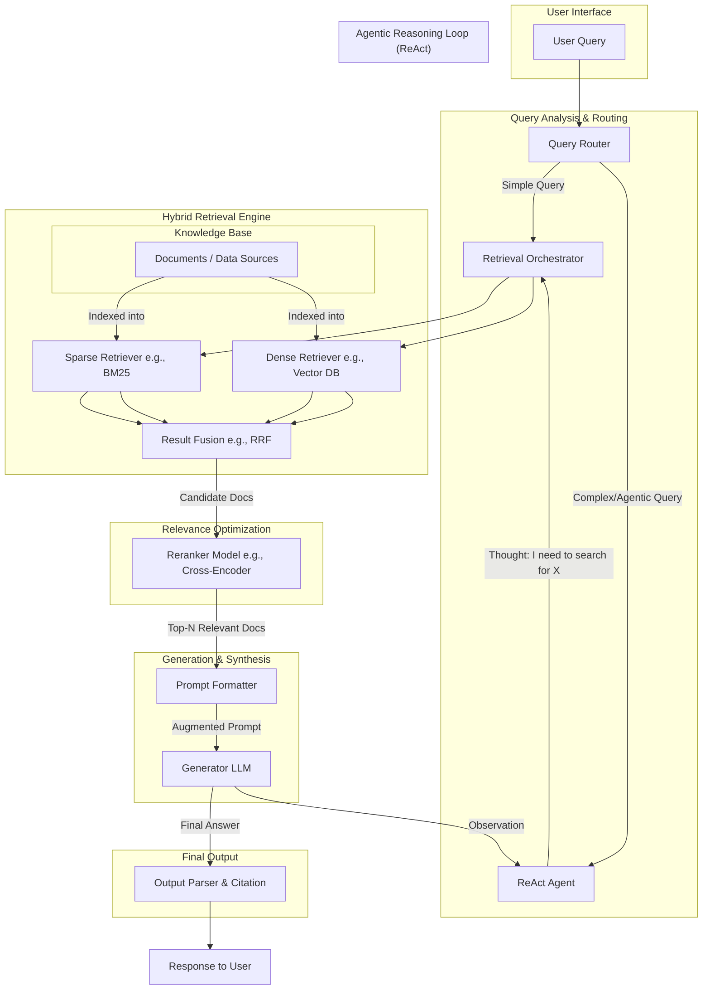

---
## Executive Summary
---
<details>
<summary>A High-Level Overview of RAG and Reasoning Frameworks</summary>
---
- This report provides a comprehensive guide to Retrieval-Augmented Generation (RAG) and associated reasoning frameworks, designed for technical implementation teams building knowledge-based AI systems.
- It deconstructs the architecture, components, and advanced techniques required to build intelligent AI systems that can reason over and interact with external knowledge bases, moving from basic RAG to sophisticated, agentic problem-solving.
- **Part 1: Detailed Tutorial** offers a detailed, step-by-step tutorial on building a foundational RAG system. It includes complete, runnable Python code using popular libraries like **LangChain** and **ChromaDB**, covering the end-to-end pipeline from document loading and chunking to answer generation with source citations.
- **Part 2: Comparative Analysis** conducts an in-depth analysis of critical RAG components and advanced reasoning frameworks. This includes a detailed breakdown and comparison of **vector databases** (Pinecone, Weaviate, Chroma), **chunking strategies** (fixed, recursive, semantic), and a taxonomy of reasoning methods like **Chain of Thought (CoT)**, **Tree of Thoughts (ToT)**, and **ReAct**.
- **Part 3: System Architecture** presents a system architecture for a production-grade, advanced RAG system. A detailed Mermaid diagram illustrates a sophisticated pipeline incorporating **hybrid search**, **reranking**, and an **agentic reasoning loop**, with a full explanation of each component's role in maximizing performance and reliability.
- **Part 4: Optimization and Evaluation** focuses on elevating a basic RAG prototype to a production-ready system. It covers performance-enhancing techniques like **hybrid search** and **reranking models**, robust evaluation methodologies using frameworks like **RAGAS**, and a practical analysis of the costs associated with RAG systems.
- **Part 5: Business Strategy** translates these complex technical concepts for a business audience. It uses simple analogies to explain what RAG is, why it's a game-changer for enterprises, and how it delivers tangible business value by mitigating AI hallucinations, unlocking proprietary data, and ensuring information currency and trustworthiness.
- The central thesis is that the future of applied AI lies in modular systems that decouple an LLM's reasoning ability from its stored knowledge. RAG provides the mechanism to ground LLMs in verifiable, real-time facts, while reasoning frameworks provide the structure for them to "think" methodically. Mastering both is essential for building trustworthy, scalable, and truly intelligent AI solutions.
---
</details>

---
## Part 1: Detailed Tutorial
---
### A Practical Guide to Building a RAG System with LangChain
<details>
<summary>A Step-by-Step Implementation Walkthrough</summary>
---
- This tutorial provides a complete, hands-on guide to building a functional Retrieval-Augmented Generation (RAG) pipeline from scratch.
- We will use popular, open-source tools from the Python ecosystem: **LangChain** as the orchestration framework, **Chroma** as the local vector database, and models from **Hugging Face** for embedding and generation.
- The goal is to create a simple question-answering system that can answer queries based on a provided text document, complete with source attribution.

---
#### Step 1: Environment Setup and Installation
- Ensure you have a Python environment (`>=3.9`). While a GPU is beneficial for the generator LLM, this example is designed to run on a CPU.
- Install the necessary libraries using pip.
  ```bash
  # Core RAG framework for orchestration
  pip install -q -U langchain
  # For using LLMs and Embedding models from Hugging Face
  pip install -q -U langchain-huggingface
  # For community-maintained integrations like document loaders
  pip install -q -U langchain_community
  # The local vector database
  pip install -q -U chromadb
  # A powerful library for accessing embedding models
  pip install -q -U sentence-transformers
  # A library for loading PDF documents
  pip install -q -U pypdf
  ```
- **Library Roles**:
  - `langchain`: The primary framework that provides the "glue" and standard interfaces (`Runnable` protocol) for chaining together different RAG components.
  - `langchain-huggingface`: Provides easy-to-use wrappers for using LLMs and embedding models from the Hugging Face ecosystem.
  - `langchain_community`: Contains a wide array of community-maintained integrations for document loaders, vector stores, and other tools.
  - `chromadb`: An open-source, developer-friendly vector database that can run locally on your machine, perfect for prototyping.
  - `sentence-transformers`: A library that provides easy access to a wide range of state-of-the-art embedding models, which we'll use to turn text into vectors.
  - `pypdf`: A library required by LangChain's `PyPDFLoader` to read and parse the content of PDF files.

---
#### Step 2: Loading and Chunking Documents
- The first step in any RAG pipeline is to load your source knowledge and break it down into manageable chunks for the vector database. If chunks are too large, they create noise; if too small, they lack context.
- For this example, create a text file named `state_of_the_union.txt` and populate it with some text (e.g., the transcript of a speech).
- **Document Loading**: LangChain provides various `DocumentLoader` classes for different file types (`.txt`, `.pdf`, `.html`, etc.).
- **Chunking**: We will use the `RecursiveCharacterTextSplitter`, which is a robust, general-purpose method. It tries to split text along a prioritized list of separators (like paragraphs `\n\n`, then sentences `.`, then words ` `) to keep semantically related text together.
  ```python
  from langchain_community.document_loaders import PyPDFLoader, TextLoader
  from langchain.text_splitter import RecursiveCharacterTextSplitter

  # In this example, we'll load a simple text file.
  # If you were loading a PDF, you would simply change this line to:
  # loader = PyPDFLoader("your_document.pdf")
  loader = TextLoader("state_of_the_union.txt")
  documents = loader.load()

  # Initialize the text splitter with parameters that control the chunk size
  text_splitter = RecursiveCharacterTextSplitter(
      chunk_size=1000,  # The maximum size of each chunk (in characters)
      chunk_overlap=200 # The number of characters to overlap between adjacent chunks to maintain context
  )

  # Split the documents into chunks
  chunks = text_splitter.split_documents(documents)
  print(f"Split the document into {len(chunks)} chunks.")
  ```

---
#### Step 3: Generating Embeddings and Storing in a Vector Database
- Next, we need to convert our text chunks into numerical vectors (embeddings) and store them in our vector database, Chroma. This process is called "indexing."
- **Embedding Model**: We will use a popular, high-performance open-source model from Hugging Face. The `BAAI/bge-base-en-v1.5` model is a strong, general-purpose choice.
- **Vector Database**: We will use ChromaDB. LangChain's Chroma integration makes it easy to create a database from our chunks and embedding model in a single step.
  ```python
  from langchain_huggingface import HuggingFaceEmbeddings
  from langchain_community.vectorstores import Chroma

  # Define the embedding model to use
  model_name = "BAAI/bge-base-en-v1.5"
  # Specify device as 'cpu' or 'cuda' if GPU is available
  model_kwargs = {'device': 'cpu'}
  # Normalize embeddings to have a length of 1, which is a common practice
  encode_kwargs = {'normalize_embeddings': True}
  
  embeddings = HuggingFaceEmbeddings(
      model_name=model_name,
      model_kwargs=model_kwargs,
      encode_kwargs=encode_kwargs
  )

  # Create a Chroma vector store from the document chunks
  # This will automatically generate embeddings for each chunk and store them.
  vectorstore = Chroma.from_documents(
      documents=chunks, 
      embedding=embeddings,
      persist_directory="./chroma_db" # Directory to save the database on disk
  )

  print("Vector store created successfully.")
  ```

---
#### Step 4: Implementing the Retrieval and Generation Chain
- With our knowledge base indexed, we can now build the question-answering part of the pipeline using LangChain Expression Language (LCEL).
- **Retriever**: The retriever is a component that fetches relevant documents from the vector store based on a query. We can easily create one from our `vectorstore`.
- **LLM**: For the generation step, we will use a model from a Hugging Face Endpoint. This is more scalable than running a large model locally. We'll use `google/flan-t5-large`, a reliable instruction-following model.
- **Prompt Template**: We create a template to structure the information (context and question) that we will send to the LLM.
- **Chain**: We "pipe" these components together using LCEL to create the final RAG chain.
  ```python
  from langchain_huggingface import HuggingFaceEndpoint
  from langchain.chains import RetrievalQA
  from langchain.prompts import PromptTemplate
  from langchain.schema.runnable import RunnablePassthrough
  from langchain.schema.output_parser import StrOutputParser
  import os

  # NOTE: You need a Hugging Face API token for this step.
  # Set it as an environment variable: os.environ["HUGGINGFACEHUB_API_TOKEN"] = "your_token"

  # Initialize the LLM from a Hugging Face Endpoint
  repo_id = "google/flan-t5-large"
  llm = HuggingFaceEndpoint(
      repo_id=repo_id, 
      max_new_tokens=256, 
      temperature=0.1
  )

  # Create the retriever
  retriever = vectorstore.as_retriever(search_kwargs={"k": 3}) # Retrieve top 3 chunks

  # Define the prompt template
  template = """
  Use the following pieces of context to answer the question at the end.
  If you don't know the answer, just say that you don't know, don't try to make up an answer.
  Keep the answer as concise as possible.
  
  Context: {context}
  
  Question: {question}
  
  Helpful Answer:
  """
  rag_prompt = PromptTemplate.from_template(template)

  # Create the RAG chain using LCEL
  rag_chain = (
      {"context": retriever, "question": RunnablePassthrough()}
      | rag_prompt
      | llm
      | StrOutputParser()
  )
  ```

---
#### Step 5: Putting It All Together: A Complete, Runnable Example
- This script combines all the previous steps into one file.
  ```python
  import os
  from langchain_community.document_loaders import TextLoader
  from langchain.text_splitter import RecursiveCharacterTextSplitter
  from langchain_huggingface import HuggingFaceEmbeddings, HuggingFaceEndpoint
  from langchain_community.vectorstores import Chroma
  from langchain.prompts import PromptTemplate
  from langchain.schema.runnable import RunnablePassthrough
  from langchain.schema.output_parser import StrOutputParser

  # --- CONFIGURATION ---
  # Make sure to create a 'state_of_the_union.txt' file with some text.
  # Set your Hugging Face API token as an environment variable
  # os.environ["HUGGINGFACEHUB_API_TOKEN"] = "hf_..." 

  if not os.getenv("HUGGINGFACEHUB_API_TOKEN"):
      raise ValueError("Hugging Face API token not set. Please set the HUGGINGFACEHUB_API_TOKEN environment variable.")

  # --- 1. LOADING & CHUNKING ---
  print("Step 1: Loading and Chunking Document...")
  loader = TextLoader("state_of_the_union.txt")
  documents = loader.load()
  text_splitter = RecursiveCharacterTextSplitter(chunk_size=1000, chunk_overlap=200)
  chunks = text_splitter.split_documents(documents)
  print(f"--> Document split into {len(chunks)} chunks.")

  # --- 2. EMBEDDING & VECTOR STORAGE ---
  print("\nStep 2: Embedding Chunks and Storing in Chroma DB...")
  embedding_model_name = "BAAI/bge-base-en-v1.5"
  embeddings = HuggingFaceEmbeddings(
      model_name=embedding_model_name,
      model_kwargs={'device': 'cpu'},
      encode_kwargs={'normalize_embeddings': True}
  )
  vectorstore = Chroma.from_documents(
      documents=chunks, 
      embedding=embeddings,
      persist_directory="./chroma_db"
  )
  print("--> Vector store created and persisted.")

  # --- 3. RETRIEVAL & GENERATION CHAIN SETUP ---
  print("\nStep 3: Setting up the RAG Chain...")
  retriever = vectorstore.as_retriever(search_kwargs={"k": 3})
  llm_repo_id = "google/flan-t5-large"
  llm = HuggingFaceEndpoint(repo_id=llm_repo_id, max_new_tokens=256, temperature=0.1)
  
  template = """
  Use the following context to answer the question. If you don't know the answer, say you don't know.
  Context: {context}
  Question: {question}
  Answer: 
  """
  rag_prompt = PromptTemplate.from_template(template)

  rag_chain = (
      {"context": retriever, "question": RunnablePassthrough()}
      | rag_prompt
      | llm
      | StrOutputParser()
  )
  print("--> RAG chain is ready.")

  # --- 4. ASK A QUESTION ---
  print("\nStep 4: Asking a question...")
  query = "What did the president say about Ketanji Brown Jackson?"
  answer = rag_chain.invoke(query)

  print("\n--- QUERY ---")
  print(query)
  print("\n--- ANSWER ---")
  print(answer)
  
  # To see the retrieved documents, you can run the retriever separately
  retrieved_docs = retriever.invoke(query)
  print("\n--- RETRIEVED SOURCE DOCUMENTS ---")
  for i, doc in enumerate(retrieved_docs):
      print(f"Source {i+1}: {doc.metadata.get('source', 'N/A')}\nContent: {doc.page_content[:200]}...\n")
  ```

---
#### Real-World Applications of RAG Systems

RAG is a versatile architecture used to build a wide range of knowledge-intensive applications. By combining the reasoning capabilities of fine-tuned models with real-time access to relevant information, RAG systems enable organizations to create intelligent applications that are both knowledgeable and up-to-date.

## Customer Support Automation

**Knowledge Base**: Product manuals, troubleshooting guides, and historical support tickets.

**Application**: A chatbot that provides instant, accurate answers to customer queries, reducing the load on human agents and improving response times.

**Detailed Implementation**:
- **Multi-Modal Knowledge Base**: Combines text documentation, video transcripts, image descriptions, and FAQ databases
- **Historical Context**: Leverages past support interactions to understand common issues and effective solutions
- **Escalation Intelligence**: Identifies when queries require human intervention and routes them appropriately
- **Personalization**: Considers customer account history, product ownership, and previous interactions
- **Real-Time Updates**: Incorporates new product releases, known issues, and solution updates immediately

**Business Impact**:
- **Cost Reduction**: 40–60% reduction in support ticket volume requiring human intervention
- **Response Time**: Instant responses vs. hours or days for human agents
- **Consistency**: Uniform, accurate responses across all customer interactions
- **24/7 Availability**: Round-the-clock support without staffing costs
- **Multilingual Support**: Automatic translation and localization of support content

**Advanced Features**:
- **Sentiment Analysis**: Detects customer frustration and adjusts response tone or escalates appropriately
- **Visual Problem Diagnosis**: Analyzes customer-uploaded images to identify hardware issues
- **Proactive Support**: Identifies potential issues based on product usage patterns and warns customers preemptively

## Internal Knowledge Management

**Knowledge Base**: A company's internal wiki, project documentation (Confluence), HR policies, and shared drive documents.

**Application**: An internal "Ask HR" or "Ask Engineering" tool that allows employees to quickly find information without having to search through multiple systems or ask colleagues.

**Comprehensive Knowledge Sources**:
- **HR Systems**: Employee handbooks, benefit information, policy documents, training materials
- **Engineering Documentation**: Architecture decisions, API documentation, coding standards, deployment procedures
- **Project Management**: Meeting notes, project timelines, decision logs, requirement documents
- **Corporate Knowledge**: Company history, org charts, process documentation, vendor relationships
- **Compliance Materials**: Security policies, regulatory requirements, audit procedures

**Specialized Applications**:
- **New Employee Onboarding**: Personalized guidance through company processes and role-specific information
- **Compliance Assistant**: Instant access to relevant policies and procedures based on employee role and location
- **Technical Knowledge Base**: Engineering teams can quickly find documentation, best practices, and troubleshooting guides
- **Process Automation**: Guided workflows for common tasks like expense reporting, time-off requests, or equipment procurement

**Organizational Benefits**:
- **Knowledge Democratization**: Equal access to information regardless of tenure or network connections
- **Reduced Knowledge Silos**: Breaking down departmental barriers to information sharing
- **Faster Decision Making**: Quick access to historical context and relevant precedents
- **Training Efficiency**: Self-service learning and skill development resources
- **Institutional Memory**: Preserving knowledge when employees leave or change roles

## Financial and Legal Analysis

**Knowledge Base**: Financial reports (10-K filings), legal contracts, case law, or market analysis documents.

**Application**: An assistant for analysts and lawyers that can summarize complex documents, identify key clauses or risk factors, and answer specific questions about the content, complete with source citations for verifiability.

**Financial Analysis Applications**:
- **Investment Research**: Analyzing earnings reports, analyst notes, and market data to generate investment recommendations
- **Risk Assessment**: Identifying potential risks across portfolios, regulatory changes, and market conditions
- **Compliance Monitoring**: Ensuring adherence to financial regulations and reporting requirements
- **Market Intelligence**: Synthesizing news, reports, and data to identify trends and opportunities
- **Due Diligence**: Comprehensive analysis of target companies for M&A transactions

**Legal Applications**:
- **Contract Analysis**: Identifying non-standard clauses, potential conflicts, and missing provisions
- **Legal Research**: Finding relevant case law, statutes, and regulations for specific legal questions
- **Regulatory Compliance**: Staying current with changing regulations and their implications
- **Litigation Support**: Analyzing case documents, depositions, and evidence for relevant information
- **Legal Brief Generation**: Drafting initial versions of legal documents with proper citations

**Advanced Capabilities**:
- **Cross-Document Analysis**: Identifying inconsistencies or conflicts across multiple related documents
- **Temporal Analysis**: Tracking changes in regulations, market conditions, or legal precedents over time
- **Risk Scoring**: Quantitative assessment of legal or financial risks based on document content
- **Citation Verification**: Ensuring accuracy and currency of legal and financial references

## Healthcare and Medical Applications

**Knowledge Base**: Medical literature, clinical guidelines, drug databases, and patient care protocols.

**Application**: Clinical decision support systems that assist healthcare providers with diagnosis, treatment recommendations, and drug interactions.

**Clinical Decision Support**:
- **Diagnostic Assistance**: Analyzing symptoms, lab results, and medical history to suggest differential diagnoses
- **Treatment Protocols**: Providing evidence-based treatment recommendations based on current guidelines
- **Drug Interaction Checking**: Real-time analysis of medication combinations and potential adverse effects
- **Medical Literature Review**: Instantly accessing relevant research papers and clinical studies
- **Care Pathway Optimization**: Suggesting optimal treatment sequences based on patient characteristics

**Specialized Medical Applications**:
- **Radiology Support**: Assisting radiologists with image interpretation and report generation
- **Pharmacovigilance**: Monitoring adverse drug reactions and safety signals across patient populations
- **Clinical Trial Matching**: Identifying appropriate clinical trials for patients based on their conditions and history
- **Medical Coding**: Automated assignment of ICD-10 and CPT codes from clinical documentation
- **Continuing Education**: Personalized medical education based on practitioner specialty and knowledge gaps

## Educational and Research Applications

**Knowledge Base**: Academic papers, textbooks, course materials, and research databases.

**Application**: Intelligent tutoring systems and research assistants that provide personalized learning experiences and accelerate scientific discovery.

**Educational Applications**:
- **Adaptive Learning**: Personalized curriculum and pacing based on student performance and learning style
- **Research Assistant**: Helping students and researchers find relevant papers, identify research gaps, and generate hypotheses
- **Academic Writing Support**: Assisting with literature reviews, citation management, and manuscript preparation
- **Language Learning**: Contextual language instruction with real-world examples and cultural references
- **STEM Education**: Interactive problem-solving with step-by-step explanations and multiple solution approaches

**Research Support**:
- **Literature Discovery**: Finding relevant papers across disciplines and identifying emerging research trends
- **Grant Writing**: Assisting researchers in identifying funding opportunities and preparing competitive proposals
- **Peer Review**: Supporting the peer review process with consistency checks and bias detection
- **Collaboration Facilitation**: Connecting researchers with complementary expertise and shared interests
- **Data Analysis**: Helping researchers interpret results and identify statistical significance

## E-commerce and Retail Applications

**Knowledge Base**: Product catalogs, customer reviews, inventory data, and market trends.

**Application**: Intelligent shopping assistants that provide personalized recommendations and detailed product information.

**Customer Experience Enhancement**:
- **Product Discovery**: Helping customers find products that match their specific needs and preferences
- **Comparison Shopping**: Detailed comparisons of products across features, price, and customer satisfaction
- **Size and Fit Guidance**: Personalized sizing recommendations based on customer measurements and product specifications
- **Compatibility Checking**: Ensuring product compatibility with existing customer purchases
- **Trend Identification**: Highlighting trending products and emerging fashion or technology movements

**Business Intelligence**:
- **Market Analysis**: Understanding customer preferences, competitive positioning, and market opportunities
- **Inventory Optimization**: Predicting demand patterns and optimizing stock levels across locations
- **Pricing Strategy**: Dynamic pricing based on market conditions, inventory levels, and customer demand
- **Customer Segmentation**: Identifying distinct customer groups and tailoring experiences accordingly
- **Supply Chain Optimization**: Optimizing vendor relationships and procurement strategies

## Manufacturing and Operations

**Knowledge Base**: Technical manuals, safety procedures, maintenance records, and quality control data.

**Application**: Operational intelligence systems that optimize manufacturing processes and ensure safety compliance.

**Operational Excellence**:
- **Predictive Maintenance**: Analyzing equipment data to predict failures and optimize maintenance schedules
- **Quality Control**: Real-time monitoring of production quality and automated defect detection
- **Safety Compliance**: Ensuring adherence to safety protocols and regulatory requirements
- **Process Optimization**: Identifying inefficiencies and recommending process improvements
- **Training and Certification**: Providing workers with just-in-time training and certification tracking

**Supply Chain Management**:
- **Supplier Evaluation**: Assessing supplier performance, risk, and reliability
- **Demand Forecasting**: Predicting product demand based on market trends and historical data
- **Logistics Optimization**: Optimizing shipping routes, inventory placement, and delivery schedules
- **Risk Management**: Identifying and mitigating supply chain risks and disruptions
- **Sustainability Tracking**: Monitoring environmental impact and sustainability metrics

## Media and Content Creation

**Knowledge Base**: News archives, social media content, market research, and audience analytics.

**Application**: Content intelligence platforms that assist journalists, marketers, and creators with research and content generation.

**Journalism and News**:
- **Investigative Research**: Analyzing large volumes of documents and data to identify stories and connections
- **Fact Checking**: Verifying claims and statements against authoritative sources
- **Source Discovery**: Finding relevant experts, witnesses, and supporting documentation
- **Trend Analysis**: Identifying emerging news trends and public sentiment shifts
- **Automated Reporting**: Generating initial drafts of news articles from press releases and data sources

**Marketing and Advertising**:
- **Audience Research**: Understanding target demographics, preferences, and behavior patterns
- **Content Performance**: Analyzing content engagement and optimizing for maximum impact
- **Competitive Analysis**: Monitoring competitor activities and identifying market opportunities
- **Brand Monitoring**: Tracking brand mentions, sentiment, and reputation across channels
- **Campaign Optimization**: Real-time adjustment of marketing campaigns based on performance data

## Government and Public Sector

**Knowledge Base**: Regulatory documents, policy papers, public records, and citizen service information.

**Application**: Citizen service platforms that provide accessible government information and streamline public services.

**Citizen Services**:
- **Service Navigation**: Helping citizens find and access appropriate government services
- **Policy Explanation**: Translating complex regulations and policies into understandable language
- **Document Processing**: Assisting with form completion and application processes
- **Benefits Eligibility**: Determining eligibility for various government programs and benefits
- **Civic Engagement**: Providing information about voting, public meetings, and civic participation opportunities

**Government Operations**:
- **Policy Analysis**: Analyzing the potential impact of proposed policies and regulations
- **Regulatory Compliance**: Ensuring government operations comply with applicable laws and regulations
- **Inter-Agency Coordination**: Facilitating information sharing and collaboration between departments
- **Emergency Response**: Providing real-time information and coordination during emergencies
- **Public Records Management**: Organizing and providing access to public information and documents

## Implementation Considerations Across Industries

### Data Privacy and Security
- **Compliance Requirements**: Adherence to industry-specific regulations (HIPAA, GDPR, SOX, etc.)
- **Access Controls**: Role-based access to sensitive information and documents
- **Data Anonymization**: Protecting personally identifiable information while maintaining utility
- **Audit Trails**: Comprehensive logging of all system interactions and data access
- **Encryption**: End-to-end encryption of data in transit and at rest

### Performance and Scalability
- **Response Time Requirements**: Meeting industry-specific latency expectations
- **Concurrent Users**: Supporting large numbers of simultaneous users and queries
- **Document Volume**: Handling large knowledge bases with millions of documents
- **Update Frequency**: Incorporating new information in real-time or near-real-time
- **Geographic Distribution**: Supporting global operations with local data centers

### Quality and Reliability
- **Accuracy Standards**: Meeting industry-specific accuracy and reliability requirements
- **Source Verification**: Ensuring information comes from authoritative and current sources
- **Bias Detection**: Identifying and mitigating potential biases in responses and recommendations
- **Error Handling**: Graceful handling of edge cases and unexpected queries
- **Continuous Monitoring**: Ongoing quality assessment and improvement processes

### Integration and Adoption
- **System Integration**: Seamless integration with existing enterprise systems and workflows
- **User Training**: Comprehensive training programs for effective system adoption
- **Change Management**: Supporting organizational change and user behavior modification
- **Feedback Loops**: Collecting and incorporating user feedback for continuous improvement
- **Success Metrics**: Defining and tracking key performance indicators for ROI measurement
---
</details>

---
## Part 2: Comparison – Analysis – Evaluation
---
### A Deep Dive into RAG Components
<details>
<summary>Analysis of Chunking Strategies</summary>
---

## Analysis of Chunking Strategies

The way documents are split into chunks is a critical, foundational step that significantly impacts retrieval quality. There is no one-size-fits-all solution.

### Fixed-Size Chunking
**Mechanism**: The simplest method. Splits text into segments of a fixed character or token count, with an optional overlap.

**Pros**: Very fast and simple to implement.

**Cons**: Semantically unaware. High risk of breaking sentences or coherent thoughts in half, which destroys context and leads to poor retrieval.

**Implementation Considerations**:
- **Chunk Size**: Typically 200–1000 tokens, depending on model context limits and retrieval requirements
- **Overlap**: 10–20% overlap helps preserve context across chunk boundaries
- **Token vs. Character Counting**: Token-based chunking is more accurate for LLM compatibility
- **Performance**: Fastest chunking method, suitable for real-time document processing

**When to Use**:
- Rapid prototyping and initial system development
- Uniform document types with consistent structure
- Performance-critical applications where speed trumps quality
- Large-scale batch processing where computational resources are limited

### Recursive Character Chunking
**Mechanism**: A more intelligent approach that attempts to split text along a prioritized list of separators (e.g., `\n\n` for paragraphs, then `\n` for lines, then `.` for sentences, then ` ` for words). It tries to keep semantically related text together.

**Pros**: A great balance of performance and semantic preservation. **This is the recommended default choice for most unstructured text documents.**

**Cons**: Still not perfect; its effectiveness depends on the structure of the text and the defined separators.

**Advanced Configuration**:
- **Separator Hierarchy**: Custom separator lists for different document types (academic papers vs. chat logs)
- **Minimum Chunk Size**: Prevents creation of very small, low-value chunks
- **Maximum Chunk Size**: Ensures chunks fit within model context windows
- **Language-Specific Separators**: Different separator priorities for different languages

**Optimization Strategies**:
- **Document Type Detection**: Automatically adjust separator hierarchies based on document format
- **Quality Metrics**: Track chunk coherence and adjust parameters based on retrieval performance
- **A/B Testing**: Compare different separator configurations for specific use cases

### Document-Specific (Structural) Chunking
**Mechanism**: Splits documents based on their intrinsic structure, such as Markdown headers (`#`), HTML tags (`<div>`), or code constructs (functions, classes).

**Pros**: Creates the most contextually coherent chunks by aligning them with the document's logical organization. This is highly effective.

**Cons**: Requires custom parsing logic for each document type, making it less generalizable than recursive chunking.

**Document Type Strategies**:

**Markdown Documents**:
- Split by header hierarchy (H1, H2, H3)
- Preserve code blocks and tables as complete units
- Maintain list structures within chunks
- Include header context in child sections

**HTML/Web Content**:
- Respect semantic HTML structure (article, section, nav)
- Handle tables, lists, and multimedia content appropriately
- Extract and index alt text and captions
- Preserve link relationships and references

**PDF Documents**:
- Utilize PDF structure (pages, sections, columns)
- Handle multi-column layouts intelligently
- Extract and process tables, figures, and captions separately
- Maintain reading order across complex layouts

**Code Repositories**:
- Function and class-level chunking
- Preserve import statements and dependencies
- Include docstrings and comments with code chunks
- Maintain file structure and module relationships

**Legal and Financial Documents**:
- Section and subsection-based chunking
- Preserve numbered clauses and references
- Handle tables, schedules, and appendices appropriately
- Maintain cross-references and citations

### Semantic Chunking
**Mechanism**: An advanced, content-aware method. It uses an embedding model to find "semantic breakpoints" between sentences where the topic changes, and splits the text there.

**Pros**: Produces the most semantically coherent chunks, leading to the highest potential retrieval accuracy.

**Cons**: Computationally expensive, as it requires running an embedding model during the indexing/chunking phase, which can be slow and costly for large document sets.

**Implementation Approaches**:

**Sliding Window Semantic Analysis**:
- Calculate embeddings for overlapping text windows
- Measure semantic similarity between adjacent windows
- Identify breakpoints where similarity drops below threshold
- Adjust breakpoints to align with natural boundaries

**Topic Modeling Integration**:
- Use topic modeling to identify thematic segments
- Combine with traditional breakpoint detection
- Ensure chunks maintain topical coherence
- Handle documents with multiple intertwined topics

**Hierarchical Semantic Chunking**:
- Create multiple levels of semantic granularity
- Enable both broad and specific retrieval queries
- Maintain parent-child relationships between chunks
- Support different retrieval strategies for different query types

**Performance Optimization**:
- **Batch Processing**: Process multiple documents simultaneously
- **Caching**: Cache embeddings for repeated processing
- **Model Selection**: Use lightweight embedding models for speed
- **Incremental Processing**: Only re-process changed sections

## Comparison Table

| Strategy    | Semantic Coherence | Computational Cost | Implementation Complexity | Best For                                                               |
|-------------|--------------------|---------------------|----------------------------|------------------------------------------------------------------------|
| Fixed-Size  | Low                | Very Low            | Very Low                   | Quick prototyping on unstructured text (not recommended for production) |
| Recursive   | Medium-High        | Low                 | Low                        | Default choice for most text documents.                            |
| Structural  | Very High          | Medium              | Medium-High                | Structured data like Markdown, code, contracts, HTML.                 |
| Semantic    | Highest            | High                | High                       | Accuracy-critical applications where indexing cost is secondary.       |

---
</details>
<details>
<summary>Vector Database Showdown: Pinecone vs. Weaviate vs. Chroma</summary>
---

## Major Players: Detailed Analysis

### Pinecone
**Positioning**: A fully managed, enterprise-grade, proprietary vector database. "The Snowflake of Vector DBs."

**Strengths**: Designed for extreme scalability (billions of vectors) with very low latency. High reliability and enterprise-grade security (SOC 2). Easy to use for teams that want to offload all infrastructure management.

**Weaknesses**: Paid service, can be costly at scale. Less flexibility due to its proprietary nature (vendor lock-in).

**Detailed Features**:
- **Performance**: Sub-millisecond query latency with p99 < 100ms at scale
- **Scalability**: Proven to handle 10B+ vectors with horizontal scaling
- **Indexes**: HNSW-based with automatic optimization and tuning
- **Security**: SOC 2 Type II, GDPR compliant, encryption at rest and in transit
- **Integration**: Native SDKs for Python, JavaScript, Java, Go
- **Monitoring**: Built-in observability with metrics and alerting

**Pricing Model**:
- **Starter**: $70/month for 100K vectors (1536 dimensions)
- **Standard**: Usage-based, ~$0.096 per 100K vectors/month
- **Enterprise**: Custom pricing with dedicated support and SLAs
- **Additional Costs**: Query costs (~$0.40 per million queries)

**Best For**:
- Enterprise applications requiring guaranteed uptime and performance
- Teams without dedicated DevOps resources
- Applications with unpredictable scaling requirements
- Companies requiring strict compliance and security certifications

### Weaviate
**Positioning**: A powerful, open-source vector database that can be self-hosted or used as a managed service.

**Strengths**: Highly flexible. Its standout feature is built-in **hybrid search** (combining vector and keyword search) and its ability to act as a "knowledge graph" by managing relationships between data objects.

**Weaknesses**: Can have a steeper learning curve due to its rich feature set and GraphQL API. Self-hosting requires operational overhead.

**Advanced Features**:
- **Hybrid Search**: Combines dense vectors with sparse (keyword) search using fusion algorithms
- **Multi-Modal**: Native support for text, images, and other data types
- **Knowledge Graphs**: Relationship modeling between objects with cross-references
- **GraphQL API**: Flexible query language for complex data retrieval
- **Auto-Classification**: Built-in ML modules for automatic data classification
- **Multi-Tenancy**: Native support for isolating data across tenants

**Architecture Options**:
- **Self-Hosted**: Full control, deploy on any infrastructure
- **Weaviate Cloud Services (WCS)**: Managed service with enterprise features
- **Hybrid Deployment**: Mix of cloud and on-premises components

**Pricing Structure**:
- **Open Source**: Free for self-hosted deployments
- **WCS Sandbox**: Free tier with 1M vectors
- **WCS Standard**: Starting at $25/month for 1M vectors
- **WCS Enterprise**: Custom pricing with advanced features and support

**Best For**:
- Applications requiring hybrid search capabilities
- Complex data relationships and knowledge graph features
- Multi-modal applications (text, images, audio)
- Organizations with strong DevOps capabilities for self-hosting
- Research and academic projects requiring advanced features

### Chroma (ChromaDB)
**Positioning**: A lightweight, open-source, developer-first vector database. "The SQLite of Vector DBs."

**Strengths**: Extremely simple to set up and use, especially for local development and prototyping. Tight integration with LangChain and the Python ecosystem.

**Weaknesses**: Less mature and not as feature-rich or proven at massive enterprise scale compared to Pinecone or Weaviate. Best for smaller-scale applications.

**Key Characteristics**:
- **Developer Experience**: Zero-configuration setup, works out of the box
- **Local-First**: Designed for local development and testing
- **Framework Integration**: Native LangChain integration, Jupyter notebook friendly
- **Simplicity**: Minimal API surface with intuitive Python interface
- **Persistence**: Multiple storage backends (in-memory, SQLite, DuckDB)

**Deployment Options**:
- **Embedded**: Run directly in Python applications
- **Client-Server**: Standalone server for multi-user scenarios
- **Docker**: Containerized deployment for easier distribution
- **Cloud (Preview)**: Managed service currently in development

**Pricing**:
- **Open Source**: Completely free for self-hosted deployments
- **Cloud Service**: Pricing not yet announced (in development)

**Best For**:
- Rapid prototyping and proof-of-concept development
- Local development and testing environments
- Educational projects and learning RAG concepts
- Small to medium-scale applications with simple requirements
- Teams prioritizing development speed over enterprise features

## Emerging and Specialized Options

### Qdrant
**Positioning**: High-performance, open-source vector database written in Rust, focusing on efficiency and advanced filtering.

**Key Features**:
- **Performance**: Rust-based implementation for maximum efficiency
- **Advanced Filtering**: Rich query language with complex filtering capabilities
- **Payload Support**: Store and filter on arbitrary JSON metadata
- **Clustering**: Built-in support for distributed deployments
- **Memory Efficiency**: Optimized memory usage and disk storage

**Best For**:
- Performance-critical applications with complex filtering needs
- Teams comfortable with newer, less established technologies
- Applications requiring efficient resource utilization
- Custom deployments with specific performance requirements

### Milvus
**Positioning**: Enterprise-focused, open-source vector database designed for large-scale production deployments.

**Key Features**:
- **Cloud-Native Architecture**: Kubernetes-native with microservices design
- **Multiple Index Types**: Support for various ANN algorithms (FAISS, Annoy, HNSWLIB)
- **Distributed Computing**: Built-in support for horizontal scaling
- **Enterprise Features**: Role-based access control, monitoring, and management tools
- **Multi-Language Support**: SDKs for multiple programming languages

**Best For**:
- Large enterprise deployments
- Organizations requiring on-premises solutions
- Applications with complex scalability requirements
- Teams with dedicated infrastructure resources

### Redis Stack
**Positioning**: Extends Redis with vector search capabilities, leveraging existing Redis infrastructure.

**Key Features**:
- **Familiar Interface**: Uses existing Redis commands and ecosystem
- **Multi-Data Model**: Combines vectors with traditional Redis data structures
- **Performance**: Leverages Redis's in-memory performance
- **Integration**: Easy integration with existing Redis deployments
- **Real-Time**: Excellent for real-time applications requiring low latency

**Best For**:
- Organizations already using Redis extensively
- Real-time applications requiring immediate responses
- Hybrid applications combining traditional caching with vector search
- Scenarios where infrastructure simplification is prioritized

## Comparison Matrix

| Feature                  | Pinecone | Weaviate | Chroma | Qdrant | Milvus | Redis Stack |
|--------------------------|----------|----------|--------|--------|--------|--------------|
| **Core Model**           | Managed  | Open/Managed | Open | Open   | Open   | Open/Managed |
| **Ideal Use Case**       | Enterprise production | Hybrid search & graphs | Prototyping | Filtering-heavy workloads | Enterprise scale | Redis-native use |
| **Scalability**          | Very High | High     | Medium | High   | Very High | High (memory-bound) |
| **Setup Complexity**     | Very Low | Medium   | Very Low | Medium | High   | Low-Medium |
| **Hybrid Search**        | No       | Yes      | No     | Partial| Limited| Partial |
| **Multi-Modal Support**  | No       | Yes      | Partial| Limited| Limited| No |
| **Filtering Capabilities** | Basic  | Advanced | Basic  | Very Advanced | Advanced | Good |
| **Security/Compliance**  | Enterprise-grade | Moderate | Low | Good | Good | Good |
| **Ecosystem**            | Growing  | Mature   | Developer-first | Growing | Enterprise-backed | Very Mature |

## Decision Framework

### Choose Pinecone When:
- Enterprise SLAs, scale, and uptime matter
- You want a fully managed experience
- Your team lacks infra resources
- You value simplicity over configurability

### Choose Weaviate When:
- You need hybrid search or knowledge graphs
- Your data includes relationships or multi-modal content
- You're comfortable with GraphQL and richer APIs

### Choose Chroma When:
- You’re building local tools or prototypes
- Simplicity and speed matter more than scale
- You're heavily invested in the Python/LangChain ecosystem

### Choose Qdrant When:
- You need advanced filtering with performance
- You're deploying on limited resources
- You want cutting-edge control and flexibility

### Choose Milvus When:
- You're building massive-scale, enterprise-grade vector systems
- You require on-prem or hybrid deployment
- You already operate in a Kubernetes-native environment

### Choose Redis Stack When:
- You already use Redis and want to extend it
- You need real-time vector search tightly coupled with existing data
- You prefer unifying tech stacks

## Advanced Considerations

### Performance Benchmarking
Evaluate with your real data, query volume, and scale targets before committing to a system.

### Migration and Vendor Lock-in
Favor open standards and exportable formats to future-proof architecture.

### Cost of Ownership
Account for DevOps, hosting, support, and feature gaps—not just licensing.

### Ecosystem and Community
Strong communities = better support, resources, and integrations. Assess activity, docs, and roadmap support.

This guide provides a strategic foundation for choosing the right vector database—whether you prioritize scalability, search features, developer experience, or production readiness.

---
</details>

---
### A Taxonomy of Reasoning Frameworks
<details>
<summary>Analysis of Reasoning Paradigms</summary>
---
- Reasoning frameworks provide structure to an LLM's thought process, elevating it from a simple text generator to a methodical problem solver.
- **Chain of Thought (CoT): The Linear Paradigm**
  - **Mechanism**: Prompts the LLM to generate a sequence of intermediate reasoning steps before giving a final answer (e.g., by adding "Let's think step by step" to the prompt). It transforms a black-box Question -> Answer process into a more transparent Question -> Reasoning -> Answer flow.
  - **Pros**: Dramatically improves performance on tasks requiring multi-step logic (math, commonsense reasoning). Simple to implement with just prompt engineering.
  - **Cons**: Brittle. It's a single, linear path. An error early in the chain corrupts the entire result, with no mechanism for self-correction.
- **Tree of Thoughts (ToT): Multi-Path Exploration**
  - **Mechanism**: Generalizes CoT by exploring multiple reasoning paths simultaneously, forming a tree structure. It follows a generate-evaluate-search cycle: 1. **Generate**: The LLM proposes several potential next steps (thoughts). 2. **Evaluate**: The LLM acts as a judge, scoring the viability of each path. 3. **Search**: A search algorithm (like Breadth-First Search or Depth-First Search) explores the most promising branches and prunes dead ends.
  - **Pros**: Far more robust than CoT for complex problems where exploration is needed (e.g., planning, puzzle-solving). Can backtrack from errors and find solutions that a linear approach would miss.
  - **Cons**: Significantly higher computational cost and latency due to the generation and evaluation of multiple paths. More complex to implement.
- **ReAct (Reasoning and Acting): The Agentic Paradigm**
  - **Mechanism**: Interleaves reasoning with action-taking, enabling the LLM to interact with external tools (like a search engine or a calculator). It operates in a **Thought -> Action -> Observation** loop:
      - **Thought**: The LLM reasons about what it needs to do next and which tool to use.
      - **Action**: It decides to use a tool and generates the input for it (e.g., a search query).
      - **Observation**: It receives the output from the tool and incorporates this new information into its context for the next thought cycle.
  - **Pros**: Transforms a static RAG pipeline into a dynamic, multi-hop reasoning process. Enables the LLM to actively seek information, ground its reasoning in real-time data, and solve complex questions that require synthesizing facts from multiple sources. **This is the foundation for modern AI agents.**
  - **Cons**: More complex to set up, as it requires defining tools and an agentic control loop. Potential for the agent to get stuck in loops or misuse tools if not guided properly.
- **Self-Consistency: Robustness Through Consensus**
  - **Mechanism**: A decoding strategy that improves the reliability of CoT. It samples multiple diverse reasoning paths for the same problem (by using a non-zero temperature). It then selects the final answer via a majority vote, based on the intuition that correct answers should be arrived at more consistently, even if the reasoning paths differ.
  - **Pros**: Significantly boosts the accuracy and robustness of CoT reasoning without changing the model.
  - **Cons**: High computational cost, as it requires generating multiple full reasoning chains.
- **Recommendations: When to Use Which Framework**
  - **Start with Chain of Thought (CoT)**: For any task that isn't a simple lookup, CoT is the baseline. Its simplicity and effectiveness make it the first tool to reach for.
  - **Use ReAct for Dynamic Information Needs**: When the question is complex and cannot be answered from a single retrieval (e.g., requires information from multiple documents or external APIs), ReAct is the standard framework for enabling multi-hop reasoning and tool use.
  - **Use Tree of Thoughts (ToT) for Exploration**: For problems with a large search space and no clear single path to a solution (e.g., strategic games, complex planning, mathematical proofs), ToT's exploratory power is invaluable, provided you can afford the computational cost.
---
</details>

---
## Part 3: System Design / Architecture
---
### Architecture for an Advanced RAG System with Reasoning
<details>
<summary>System Architecture Diagram</summary>
---
- This diagram illustrates a sophisticated, production-grade RAG system that incorporates advanced concepts like hybrid search, reranking, and an agentic reasoning loop.
### System Architecture Diagram


---
</details>
<details>
<summary>Explanation of Architectural Components</summary>
---
- This architecture represents a mature, high-performance RAG system designed for production environments.

---
#### Query Analysis & Routing
- **Query Router**: An initial, lightweight LLM call that acts as a smart traffic cop. It analyzes the user's query to determine its complexity.
- For a simple fact-based question ("What is RAG?"), it can pass the query directly to the retrieval engine.
- For a complex, multi-step question ("Compare RAG with fine-tuning for a chatbot application"), it can invoke the `ReAct Agent` to handle the task methodically.

---
#### Agentic Reasoning Loop (ReAct)
- **ReAct Agent**: The "brain" of the system for complex tasks. It's an LLM configured to operate in the `Thought -> Action -> Observation` cycle.
- It can break down a complex query into multiple steps. For example, it might first search for "RAG benefits," then search for "fine-tuning benefits," and finally use both sets of observations to synthesize a comparison.

---
#### Hybrid Retrieval Engine
- **Retrieval Orchestrator**: Manages the retrieval process. It receives a query from either the router or the agent.
- **Sparse Retriever**: A keyword-based search engine (e.g., using the BM25 algorithm). It excels at finding documents with specific, exact terms (like product codes, names, or acronyms).
- **Dense Retriever**: A vector database that performs semantic search. It excels at understanding the conceptual meaning and intent behind a query, even if the exact keywords aren't present.
- The orchestrator runs searches on both retrievers in parallel to leverage the strengths of each.

---
#### Relevance Optimization
- **Result Fusion**: This component takes the ranked lists from both the sparse and dense retrievers and merges them into a single, unified list of candidate documents. A common algorithm for this is Reciprocal Rank Fusion (RRF), which prioritizes documents that rank highly in *both* lists.
- **Reranker Model**: This is a crucial precision-enhancing step. It takes the larger list of fused candidates (e.g., top 50) and uses a more powerful but computationally expensive model (like a cross-encoder) to re-evaluate their relevance to the original query. It outputs a much smaller, highly relevant list (e.g., top 3-5), which significantly improves the quality of the context provided to the generator and mitigates the "lost in the middle" problem.

---
#### Generation & Synthesis
- **Prompt Formatter**: Constructs the final prompt for the generator LLM, carefully combining the original query with the highly relevant, reranked context documents.
- **Generator LLM**: A powerful LLM that receives the augmented prompt and synthesizes a final, human-readable answer.
- **Output Parser & Citation**: A final step that formats the LLM's raw output. It extracts the answer and, crucially, adds citations based on the metadata of the source documents that were used, ensuring verifiability and trustworthiness.

- How planning works ? ([image source](https://langchain-ai.github.io/langgraph/tutorials/plan-and-execute/plan-and-execute/)):
    
---
</details>

---
## Part 4: Optimization, Cost, and Deployment
---
### Advanced Techniques and Performance Optimization
<details>
<summary>Strategies for Maximizing RAG Performance</summary>
---
- Building a basic RAG system is straightforward, but achieving production-grade performance requires several advanced optimization techniques.

---
#### Enhancing Retrieval with Hybrid Search
- **The Problem**: Vector search (dense retrieval) is great for understanding semantic meaning but can fail on specific keywords. Keyword search (sparse retrieval) is the opposite. Relying on only one method will inevitably fail for certain types of queries.
- **The Solution**: Hybrid search combines both.
- **Process**: Run a dense search and a sparse search in parallel.
- **Fusion**: Merge the two lists of results. A common technique is Reciprocal Rank Fusion (RRF), which prioritizes documents that rank highly in *both* lists, providing a more robust final ranking.
- **Benefit**: This creates a system that is robust to a wide variety of query types, capturing both semantic intent and keyword specificity. It is the de facto standard for modern, high-performance RAG.

---
#### The Reranker: A Precision-Enhancing Filter
- **The "Lost in the Middle" Problem**: LLMs struggle to pay attention to information buried in the middle of a long context. If your retriever returns 10 documents and the correct one is the 7th, the LLM may ignore it.
- **The Solution**: Use a two-stage retrieval process with a reranker.
- **Stage 1 (Recall)**: The hybrid retriever fetches a large number of candidate documents (e.g., top 50) to ensure the answer is likely present somewhere in the set.
- **Stage 2 (Precision)**: A powerful **cross-encoder** model (which is more accurate but slower than the initial retrieval models) re-scores this smaller set of 50 documents based on their direct relevance to the query.
- **Benefit**: The reranker pushes the most relevant documents to the top of the list. By sending only the top 3-5 reranked documents to the LLM, you provide a clean, highly relevant context, dramatically improving answer quality and reducing hallucinations.

---
#### Multi-Hop Reasoning and Query Transformation
- **The Problem**: Complex questions often require finding and connecting information from multiple documents (multi-hop reasoning). A single retrieval based on the original query will fail.
- **Example**: "Which director, who won an Oscar for a film released in the 1990s, also directed a movie starring Tom Cruise?"
- **Solutions**:
  - **ReAct Agents**: As shown in the architecture, an agent can break the problem down, perform a retrieval for each sub-question ("Oscar-winning directors 1990s", "Tom Cruise filmography"), and use the observations to inform the next step.
  - **Query Transformation**: Before retrieval, use an LLM to "transform" the user's query.
    - **Hypothetical Document Embeddings (HyDE)**: The LLM generates a hypothetical, ideal answer to the query first. The embedding of this *hypothetical answer* is then used for the vector search, which can often be more effective at finding relevant documents than the embedding of the original, short query.
    - **Step-Back Prompting**: The LLM is prompted to take a "step back" and generate a more general, high-level question. Retrieving documents for this general question can provide useful background context for answering the original, more specific query.
---
</details>
### Evaluating RAG System Performance
<details>
<summary>Metrics and Frameworks for RAG Evaluation</summary>
---
- Evaluating a RAG system is complex because you need to measure both the retrieval quality and the generation quality. "You can't improve what you can't measure."

---
#### Key Evaluation Metrics
- A comprehensive evaluation should measure the performance of each part of the pipeline.
- **For the Retrieval Component**:
- **Context Precision**: Out of the documents retrieved, how many are actually relevant? (High precision means less noise is sent to the LLM).
- **Context Recall**: Out of all the relevant documents that exist in the knowledge base, how many did the retriever find? (High recall means the system is not missing crucial information).
- **For the Generation Component**:
- **Faithfulness**: Does the generated answer stay true to the information provided in the retrieved context? A low faithfulness score indicates the model is hallucinating or adding outside information.
- **Answer Relevance**: How well does the generated answer address the user's actual query? The answer could be factually correct based on the context but still not be relevant to what the user asked.

---
#### The RAGAS Framework
- **What it is**: RAGAS (Retrieval-Augmented Generation Assessment) is a popular open-source framework for automated, reference-free evaluation of RAG pipelines.
- **How it Works**: It uses an LLM to perform the evaluations, measuring the key metrics (Faithfulness, Answer Relevance, Context Precision, Context Recall) without needing a human-written "ground truth" answer for every question.
- **Example Checks**:
- To measure **Faithfulness**, RAGAS breaks the generated answer down into individual statements and cross-references each one with the provided context to see if it's supported.
- To measure **Answer Relevance**, it uses an LLM to repeatedly generate potential questions that the answer could be for, and then checks how similar these generated questions are to the original user query.
- **Benefit**: RAGAS allows for rapid, automated testing and benchmarking of different RAG configurations (e.g., trying different chunk sizes or reranker models) to find the optimal setup for your specific use case.
---
</details>
### Cost Analysis and Deployment Considerations
<details>
<summary>Understanding the Economics and Logistics of RAG</summary>
---
- A successful RAG deployment requires a clear understanding of the ongoing operational costs.

---
#### Cost Breakdown of a RAG System
- The total cost is a sum of its parts, which can be optimized individually.
- **Embedding Costs**:
  - **During Indexing**: There is a one-time, upfront cost to generate embeddings for all your source documents. This is usually paid per token to an API provider like OpenAI or Cohere.
  - **During Querying**: There is a small, ongoing cost to embed each user query.
  - **Optimization**: You can eliminate this cost by using a high-quality open-source embedding model (like BAAI/bge-large-en-v1.5) and running it on your own infrastructure.
- **Vector Database Costs**:
  - **Managed Services (Pinecone, Weaviate Cloud)**: These typically charge based on the number of vectors stored and the amount of data indexed, often with tiered pricing.
  - **Self-Hosted (Chroma, Weaviate)**: The software is free, but you pay for the underlying cloud infrastructure (compute instances, storage) required to run it.
- **LLM API Costs**:
  - This is often the **largest ongoing cost**. You pay per token for both the input (the augmented prompt) and the output (the generated answer).
  - **Optimization**:
    - Use a reranker to send a smaller, more relevant context to the LLM, reducing input tokens.
    - Use a "cascade" approach: use a smaller, cheaper model for simple tasks (like query routing) and reserve the most powerful models for complex generation.

---
#### Deployment Strategies
- **Serverless Deployment**:
  - **Examples**: AWS Lambda, Google Cloud Functions, or dedicated platforms like Hugging Face Inference Endpoints.
  - **Best For**: Applications with low or sporadic traffic.
  - **Pros**: Highly cost-effective, as you only pay when the function is running. The platform handles scaling automatically.
  - **Cons**: Can suffer from "cold start" latency, where the first request after a period of inactivity is slow.
- **Containerized (Always-On) Deployment**:
  - **Examples**: Using Docker to package the RAG application and deploying it on a service like AWS ECS or Kubernetes (EKS).
  - **Best For**: Applications with consistent, high traffic where low latency is critical.
  - **Pros**: No cold starts, providing consistently fast responses. Maximum control over scaling and the environment.
  - **Cons**: More expensive, as you are paying for the GPU instance to be running 24/7, even when it's idle. More complex to manage.
---
</details>

---
## Part 5: For a Business Audience
---
### The "Why" of RAG: A Non-Technical Guide
<details>
<summary>Core Concepts in Simple Analogies</summary>
---
- This section explains the powerful concepts behind RAG using straightforward, non-technical analogies.

---
#### Standard AI: The "Closed-Book Exam"
- A standard Large Language Model (like the base version of ChatGPT) operates like a student taking a **closed-book exam**.
- It has studied an enormous amount of information (the internet up to a certain date) and is answering questions based purely on what it has memorized.
- This is impressive, but it has two major flaws:
  - **It can't learn new things**: If you ask it about something that happened after its training, it simply won't know. Its knowledge is frozen in time.
  - **It can "hallucinate"**: If it's unsure of an answer, it might guess and make up a confident-sounding but incorrect fact, just like a student bluffing on an exam. This is unacceptable for business use.

---
#### RAG: The "Open-Book Exam" with a Research Assistant
- **Retrieval-Augmented Generation (RAG)** fundamentally changes the rules. It turns the closed-book exam into an **open-book exam**, and gives the student a super-fast research assistant.
- The "book" is your company's specific knowledge base: your product manuals, HR policies, customer support history, legal documents, etc.
- **How it works**:
  - **1. Retrieve (Look it up)**: When asked a question, the AI's first step is to have its research assistant instantly find the most relevant pages in your company's "book."
  - **2. Augment (Read the context)**: It takes the information it found and adds it to the original question.
  - **3. Generate (Formulate the answer)**: It then uses its powerful language skills to formulate a perfect answer, based *specifically* on the information it just read from your trusted documents.

---
#### Why RAG is a Game-Changer for Business
- **It's Always Up-to-Date**: To teach the AI about a new product, you don't need to retrain the entire model. You just add the new product's manual to the "book" (the knowledge base). It's instant and cheap.
- **It's Trustworthy and Verifiable**: The AI's answers are grounded in your actual documents. It dramatically reduces the risk of making things up. Crucially, it can also provide citations, showing you the exact source document it used to formulate the answer, just like a footnote in a research paper. This builds trust and allows for verification.
- **It's Secure**: The "book" is your private data. The RAG system can be built within your secure cloud environment, so your proprietary information never needs to be sent to a third-party vendor.
---
</details>
### Business Benefits and Strategic Value
<details>
<summary>How RAG Creates a Competitive Advantage</summary>
---
- Implementing a RAG system is more than a technology project; it's a strategic investment in creating a proprietary, intelligent asset.

---
#### Mitigating Hallucinations and Building Trust
- **The #1 Benefit**: The single biggest barrier to enterprise adoption of generative AI is the fear of "hallucinations" (factually incorrect outputs).
- RAG is the most effective technology for solving this problem. By forcing the AI to base its answers on a trusted set of documents, it dramatically increases factual accuracy and reliability.
- The ability to cite sources transforms the AI from a "black box" into a transparent and trustworthy tool, which is essential for use in critical business functions like legal, finance, and healthcare.

---
#### Unlocking the Value of Proprietary Knowledge
- Every company has vast amounts of valuable information locked away in unstructured documents: PDFs, Word docs, wikis, support tickets, etc. This is often referred to as "dark data."
- RAG brings this data to life. It transforms your static, hard-to-search internal documentation into a dynamic, interactive knowledge base that any employee can converse with.
- This creates a powerful, proprietary AI asset that is unique to your business and cannot be replicated by competitors using generic, public AI models.

---
#### Agility and Cost-Effectiveness
- The alternative to RAG for teaching an AI new information is "fine-tuning," which is like sending the AI back to school for an expensive and time-consuming retraining process.
- RAG is far more agile and economical. Keeping the AI's knowledge current is as simple as updating a document in a folder.
- This allows businesses to keep their AI systems perfectly aligned with their real-time operations, product updates, and market changes, without incurring the massive costs of continuous model retraining.
---
</details>
### High-Impact Business Use Cases
<details>
<summary>Practical Applications That Drive ROI</summary>
---
- RAG is not a theoretical concept; it's a practical solution being deployed today to solve major business challenges.
- **Hyper-Personalized Customer Support**:
  - **Application**: A customer support chatbot powered by a RAG system that has ingested every product manual, troubleshooting guide, and technical specification document.
  - **Value**: Provides instant, 24/7 support that is highly accurate and specific to the customer's issue. It can walk users through complex troubleshooting steps, citing the exact page in the manual. This reduces agent workload, cuts support costs, and dramatically improves customer satisfaction.
- **Intelligent Internal Knowledge Management**:
  - **Application**: An internal search tool for employees, built on top of all company documents (HR policies, IT guides, project histories, sales best practices).
  - **Value**: Empowers every employee to be an expert. New hires can get up to speed in days instead of months. Engineers can solve problems without interrupting senior staff. Salespeople can instantly find the perfect case study for a client. This boosts productivity across the entire organization.
- **Accelerated Research and Due Diligence**:
  - **Application**: A research assistant for legal or financial teams that has access to a secure database of thousands of contracts, depositions, or financial filings.
  - **Value**: Transforms a process that used to take weeks of manual labor into one that takes minutes. An analyst can ask complex questions like, "Summarize all risk factors related to supply chain issues mentioned in the last five quarterly reports," and receive a synthesized, cited answer instantly. This provides a massive competitive edge in time-sensitive fields.
---
</details>
